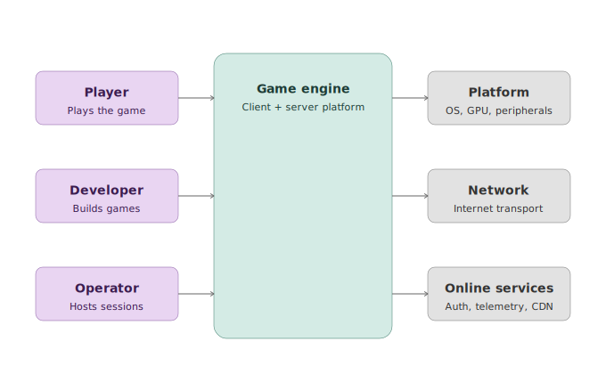
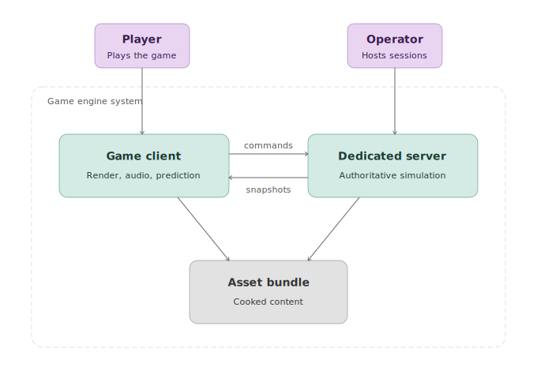
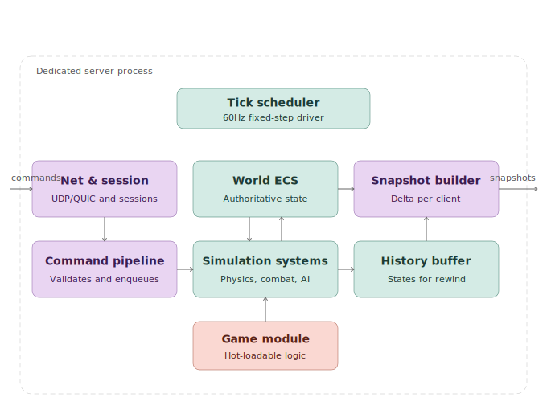
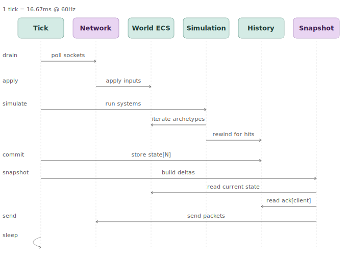
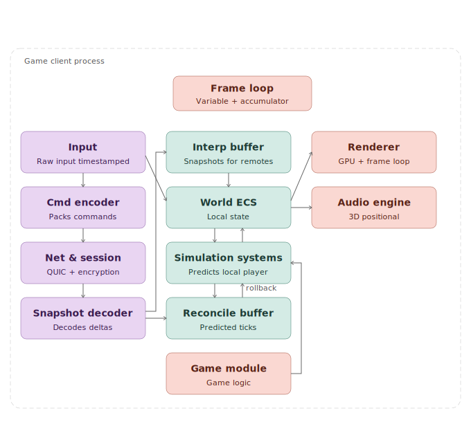
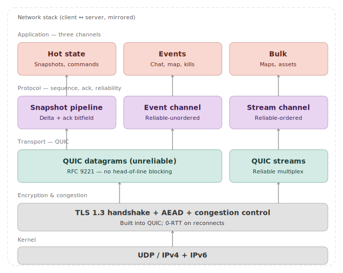

# Game Engine — Architecture

Living architecture document for the engine. Quake 2-style (authoritative client/server), with modern advances: archetype-based ECS, QUIC transport, client-side prediction + reconciliation.

**Status:** Active development — M3 implemented (foundations, ECS, QUIC networking, client-side prediction, slot state machine, handshake validation, delta snapshots with ack bitfield, remote interpolation). See [roadmap](#implementation-roadmap) for milestone status.
**Audience:** author + future contributors.
**Convention:** each section ends with decisions recorded as embedded ADRs. `**Status: implemented**` means the decision is live in code; `**Status: planned**` means it is a design commitment not yet coded. When a decision is extracted to its own file, it moves to `docs/adr/NNNN-title.md`.

---

## Executive summary

Multiplayer engine for arena games (up to 64 players @ 60 Hz), with authoritative dedicated server and client featuring client-side prediction + server reconciliation. Modular Rust monorepo, with a shared core library between client and server, and separate binaries for each role.

**Non-goals:** listen-server, peer-to-peer, MMO/large shards, pure offline single-player (offline runs a local dedicated server).

---

## Level 1 — Context

The actors and external systems the engine interacts with.



- *Player* — input/output via client.
- *Developer* — writes game code + tooling.
- *Operator* — runs/monitors dedicated servers.
- *Platform* — OS, GPU, audio, controllers; abstracted via HAL/RHI.
- *Network* — packet transport (QUIC/UDP).
- *Online services* — auth, matchmaking, telemetry, CDN.

### ADR 0001 — Topology: dedicated server only

**Decision:** support dedicated server only (separate, headless process). Offline single-player runs a local dedicated server on loopback.

**Rationale:** authority 100% on server, always. Client is purely I/O terminal + prediction. Server compiles without GPU/audio/input.

**Status: implemented.** `blackflowerd` is headless; `blackflowerc` is the I/O terminal. Both share `blackflower-gameplay` and `blackflower-protocol` but not rendering or window crates.

### ADR 0002 — Target scale: arena ~64 players @ 60 Hz

**Decision:** primary target is arena/shooter up to 64 players @ 60 Hz tickrate.

**Consequences:** snapshot-based networking, client-side prediction, lag-comp via rewind in history buffer, no area-of-interest.

**Status: partially implemented.** Tick scheduler and QUIC broadcast support the scale target. Delta snapshot compression (M3) is implemented; lag-comp via history-buffer rewind is planned for M4.

---

## Level 2 — Containers (runtime)

The processes that run in production and how they communicate.



- Commands and snapshots are distinct channels. Commands = player input (client → server datagram). Snapshots = world state (server → client datagram).
- Requests/Events are reliable control messages carried on QUIC streams (client → server / server → client respectively).

### ADR 0003 — Client/server communication: asymmetric on two channels

**Decision:** two distinct logical channels — commands (client → server) and snapshots (server → client). Both unreliable (QUIC datagrams). Reliable control messages use QUIC streams (COBS-framed).

**Rationale:** snapshots are idempotent in aggregate (tick N+1 supersedes N); reliability adds latency without adding correctness.

**Status: implemented.** Commands and snapshots use `quinn` datagrams. `Request`/`Event` use a single bidirectional QUIC stream per connection with COBS framing.

---

## Level 3 — Dedicated server components



**Implemented components:**

- **Tick scheduler** — `TickScheduler::start(60)` drives a fixed-rate loop. Logs overruns.
- **SimulationWorld** — `hecs`-backed ECS; `EntityIdAllocator` issues monotonic IDs (never reused).
- **Command pipeline** — drains one `Command` per client per tick; applies `apply_player_movement()`; records `last_processed[client]`.
- **Snapshot builder** — every tick, iterates all `Transform` components; builds `Snapshot { tick, ack: last_processed[client], entities }` and sends as datagram.
- **Session management** — `conn_entities: HashMap<ConnectionId, EntityId>` and `last_processed: HashMap<ConnectionId, Tick>`; `Hello` request spawns entity, disconnect despawns it.
- **Physics** — `integrate_movement()` applied per tick to `(Transform, Velocity)` pairs.

**Not yet implemented:**

- Job system (parallelizes inside each system) — single-threaded today.
- History buffer for server-side lag compensation.
- Anti-cheat hooks in command pipeline.
- Asset loader / map loading.
- Telemetry sink.
- Game module as a hot-loadable cdylib (see ADR 0006).

### ADR 0004 — Archetype-based ECS

**Decision:** ECS with archetypes (entities with the same set of components live in contiguous chunks), not sparse-set.

**Rationale:** bulk iteration (simulation pattern) is cache-friendly. `add_component`/`remove_component` is rare and can pay the move-between-archetype cost.

**Status: implemented.** `blackflower-world` wraps `hecs 0.11`.

### ADR 0005 — Fixed 60 Hz tick

**Decision:** server runs a fixed 16.67 ms tick. Inputs arriving mid-tick wait for the next one. Client renderer is variable (independent).

**Rationale:** determinism. Client and server must produce identical results for identical inputs; physics with variable `dt` diverges.

**Status: implemented.** `TickScheduler` drives both server and client tick loops at the configured Hz. Client render and input run on a separate winit event loop thread.

### ADR 0006 — Game logic in hot-loadable cdylib

**Decision:** game logic lives in a dynamic library, loaded at runtime. In dev, supports unload+reload+state migration.

**Rationale:** fast iteration cycle (Quake's `game.dll`).

**Risk:** unstable Rust ABI → shared types must be FFI-safe (`#[repr(C)]`).

**Status: planned.** Game logic currently lives in `blackflower-gameplay` (a static crate). The `Transform`, `Velocity`, and `InputButtons` types are `#[repr(C)]` in anticipation of this migration.

---

## Level 3 — Anatomy of a server tick (sequence)



**Invariants (as implemented):**

1. `drain → apply → simulate` — all inputs ready before simulating.
2. Ack tracked per-client; echoed in snapshot for client reconciliation.
3. Snapshot sent after physics integrate (world is fully committed).
4. Send is N parallel sends via per-client tokio channels; slow clients drop packets, others unaffected.

**Actual per-tick work (current):**

```
1. try_recv_connects()      — insert SlotState::Handshake
2. try_recv_requests()      — Hello: Handshake→Playing (version + capacity check)
                            — Ping: send Pong (NTP clock sync)
3. try_recv_commands()      — apply_player_movement() per Playing client
                            — update baseline_tick from snapshot ack bitfield
4. try_recv_disconnects()   — Playing→Zombie (entity held 5 s)
5. expire_zombies()         — despawn entities past TTL, remove slot
6. integrate_movement()     — Euler integrate all (Transform, Velocity)
7. world.snapshot()         — iterate Transforms, build WorldSnapshot, insert into ring
8. build_delta()            — per Playing client: delta vs baseline or full snapshot
9. try_send_snapshot_to()   — enqueue WorldDelta to per-client channel
```

---

## Level 3 — Game client components



**Implemented components:**

- **Tick thread** — `TickScheduler` at 60 Hz; owns `PresentationWorld`, `PredictionState`, `ClientHandle`.
- **Render thread** — winit event loop; `App` implements `WindowHandler`; reads `FrameBuffer` via `ArcSwap` (lock-free).
- **Input** — `InputHandle` (thread-safe `Arc<Mutex<InputButtons>>`); render thread writes, tick thread reads.
- **PresentationWorld** — upserts entities from server snapshots; `extract()` returns flat `Vec<(EntityId, Transform)]` for renderer.
- **PredictionState** — rollback-replay reconciliation (see ADR 0007).
- **Renderer** — wgpu pipeline; one instanced draw call per frame, per-instance model matrix via SSBO.

**Not yet implemented:**

- Interpolation for remote entities (currently shown at last-known authoritative position).
- Extrapolation / dead reckoning for remote entities under packet loss.
- Audio (`blackflower-audio` is a stub).

### ADR 0007 — Client-side prediction with rollback-replay

**Decision:** client predicts local player input speculatively using the same pure simulation functions as the server. On snapshot arrival, roll back to the server's authoritative state and replay unacked inputs.

**Rationale:** hides RTT latency for local player; eliminates input-induced position error via reconciliation.

**Status: implemented.** `PredictionState` keeps a `VecDeque<HistoryEntry>` ring buffer of 128 ticks (~2.1 s @ 60 Hz). On each tick:

1. **predict(tick, buttons, seed, dt)** — applies `apply_player_movement()` locally; pushes to history.
2. **reconcile(authoritative, ack, dt)** — drops history entries `tick ≤ ack`, rolls back to server transform, replays remaining inputs in order.
3. **extract** — overwrites local player's transform in `PresentationWorld` before publishing to framebuffer.

`apply_player_movement()` is a pure function shared by `blackflower-gameplay`; server and client run identical code, so prediction is exact given identical inputs and `dt`.

### ADR 0007b — Frame loop: separate tick and render threads

**Decision:** client uses two threads. Tick thread: fixed 60 Hz `TickScheduler`. Render thread: winit event loop at display rate. Data published via lock-free `ArcSwap<Box<[(EntityId, Transform)]>>` framebuffer.

**Rationale:** decouples simulation rate from frame rate. Render never blocks on network I/O; tick never blocks on GPU.

**Status: implemented.** See `bins/blackflowerc/src/main.rs`. `PresentationWorld` maintains up to 8 `TransformSample` entries per entity; `resolve()` in `Replica` computes a clock-estimated target tick and calls `interpolate()` with a 2-tick delay buffer.

---

## Level 3 — Engine core (shared library)

**Principles (as applied in current code):**

1. **Determinism first** — `apply_player_movement()` and `integrate_movement()` are pure functions with no global state, no RNG.
2. **Headless by construction** — server binary has zero GPU/audio/window dependencies.
3. **Vertical dependencies only** — lower-level crates (`blackflower-math`, `blackflower-entity`, `blackflower-protocol`) have no dependencies on higher-level ones.

**Crate dependency order (leaf → root):**

```
blackflower-math
blackflower-entity
blackflower-protocol
blackflower-input   → math
blackflower-gameplay → input, math
blackflower-physics  → math
blackflower-tick
blackflower-world    → entity, protocol, tick
blackflower-authority → world, network, protocol, tick, physics, gameplay, input, entity
blackflower-replica  → world, network, protocol, tick, gameplay, input, entity
blackflower-network  → protocol, tick
blackflower-graphics → math, entity
blackflower-window
blackflower-audio    (stub)

blackflowerd → authority, network, protocol, tick, physics, gameplay, input, entity
blackflowerc → replica, world, network, protocol, tick, input, graphics, window, entity, audio
```

### ADR 0008 — Math: IEEE float throughout; fixed-point deferred

**Decision:** IEEE 754 floats for all simulation math. Q16.16 fixed-point for networked movement is deferred until delta compression (M3) requires it.

**Rationale:** avoids holding development velocity hostage to determinism work where it doesn't yet matter. Clear boundary between wire and simulation types allows migration later.

**Status: implemented (IEEE float in use).** Fixed-point encoding is deferred — no longer tied to M3. `Transform` is `#[repr(C)]` in preparation for a future migration if quantized delta snapshots are ever adopted.

### ADR 0016 — ECS: hecs (not bevy_ecs)

**Decision:** `hecs` as the foundation. Scheduler, change detection, and command buffers are implemented in the engine as a layer over `hecs`.

**Rationale:** avoid architectural coupling to the Bevy ecosystem. `hecs` (~5000 LOC) is auditable; its API has been stable for years. `bevy_ecs` breaks across major versions.

**Trade-offs accepted:** ~2–3 months additional engineering for a custom scheduler; smaller third-party ecosystem.

**Status: implemented.** `blackflower-world` wraps `hecs::World`. No custom scheduler yet — systems are called directly in tick loop order.

---

## Level 3 — Network protocol



### Wire format (current implementation)

All messages are serialized with `postcard` (compact binary, little-endian, no schema).

**Command** (client → server, unreliable datagram):

```
tick:              u64   (8 bytes)
buttons:           u64   (8 bytes, InputButtons bitfield)
snapshot_ack_tick: u64   (8 bytes — reference tick for ack window)
snapshot_ack_bits: u32   (4 bytes — bit i set = received tick ack_tick−i)
─────────────────────────────────────────────────────────────────────
                          ~28 bytes per command
```

**WorldDelta** (server → client, unreliable datagram):

```
tick:     u64             (8 bytes)
ack:      u64             (8 bytes — highest client command tick processed)
baseline: u64             (8 bytes — 0 = full snapshot; N = delta vs tick N)
removed:  [u64]           (varint count + removed entity IDs × 8 bytes)
entities: [EntityDelta]   (varint count + N entries)

EntityDelta:
  id:          u64                 (8 bytes)
  translation: Option<[f32; 3]>   (1 + 12 bytes if present, 1 byte if absent)
  rotation:    Option<[f32; 4]>   (1 + 16 bytes if present, 1 byte if absent)
─────────────────────────────────────────────────────────────────────
Full snapshot:  ~24 + N × 30 bytes
Delta snapshot: ~24 + removed × 8 + changed × 2–30 bytes (only dirty fields)
```

Server keeps last 32 `WorldSnapshot`s in `SnapshotRing` (indexed by `tick % 32`).
Change detection uses `f32::to_bits()` (bit-exact, handles −0/NaN correctly).

**Control messages** (QUIC stream, COBS-framed, zero-terminated):

```
Request::Hello { protocol_version: u32 }           (client → server, ~5 bytes)
Request::Ping  { client_send_ns: u64 }             (client → server, ~9 bytes)
Event::Welcome { tick_hz: u64, assigned_entity_id: u64 }  (server → client, ~17 bytes)
Event::Rejected { reason: RejectReason }           (server → client, ~2–9 bytes)
Event::Pong    { client_send_ns: u64, server_tick: u64 }  (server → client, ~17 bytes)
```

**Bandwidth (post M3 delta compression, static-world baseline):**

- Full snapshot @ 64 entities: ≈ 1.9 KB
- Delta snapshot (typical active match): ≈ 50–400 bytes depending on movement
- Downstream per client @ 60 Hz (active): ≈ 3–24 KB/s
- Quantization deferred indefinitely (see ADR 0008)

### ADR 0009 — Transport: QUIC datagrams (hot) + QUIC streams (bulk)

**Decision:** QUIC with datagrams (RFC 9221) for hot state (commands + snapshots), streams for control (requests + events). Mandatory TLS 1.3.

**Rationale:** QUIC gives encrypted handshake, mature congestion control, connection migration, 0-RTT on reconnects.

**Dev caveat:** self-signed certs and `SkipServerVerification` are used in development. Both server and client accept `--fake-latency-ms` / `--fake-jitter-ms` CLI flags to simulate network conditions locally.

**Status: implemented.** `blackflower-network` wraps `quinn`. Dev cert helpers in `cert.rs`. `DelayQueue` implements per-message latency + jitter.

### ADR 0010 — Reliable events on QUIC streams

**Decision:** critical events (`Hello`, `Welcome`) use a COBS-framed reliable QUIC stream, not application-layer retransmit over datagrams.

**Rationale:** stream reliability is free in QUIC; using it for low-frequency control messages avoids building a custom reliability layer.

**Status: implemented.** One bidirectional stream per connection; framed with `encode_framed`/`decode_framed` (COBS, zero-terminated).

---

## Level 3 — Connection lifecycle (current implementation)

Simplified relative to the full state machine design; implemented states:

```
Client connects (QUIC handshake)
  → server: SlotState::Handshake inserted
  → client sends Request::Hello { protocol_version }
  → server: version check, capacity check
      ✗ mismatch → Event::Rejected { VersionMismatch | ServerFull }
      ✓ ok       → entity spawned, SlotState::Playing, Event::Welcome { tick_hz, assigned_entity_id }
  → client: begins prediction, tick loop starts

Client disconnects / connection drops
  → server: SlotState::Zombie { entity, until: tick + 5 s }
  → entity stays in world (visible to others) during zombie window
  → zombie TTL expires → entity despawned, slot removed
```

**Not yet implemented:** identity-based reconnect (requires auth token in Hello), authentication, lobby, match state machine.

### ADR 0011 — Slot state machine as typed enum

**Decision:** each slot state is a variant of a typed enum with typed payload. Invalid transitions don't compile.

**Status: implemented.** `blackflower-authority` uses `HashMap<ConnectionId, SlotState>` where `SlotState` is a typed enum. Transitions: QUIC connect → `Handshake`; validated `Hello` → `Playing`; disconnect → `Zombie` (5 s TTL); TTL expiry → entity despawned, slot removed. `Free` is implicit (absent from the map). Commands and snapshot broadcasts only reach `Playing` slots.

---

## Level 3 — Monorepo structure (actual)

```
blackflower/
├── Cargo.toml                      # workspace (resolver v3, shared lints)
├── rust-toolchain.toml             # pinned to stable 1.95.0
├── clippy.toml                     # lint thresholds
├── bins/
│   ├── blackflowerd/               # dedicated server binary
│   └── blackflowerc/               # client binary (winit + wgpu)
├── crates/
│   ├── blackflower-audio/          # stub (kira wired, no logic yet)
│   ├── blackflower-entity/         # EntityId, EntityIdAllocator
│   ├── blackflower-gameplay/       # pure simulation functions
│   ├── blackflower-graphics/       # wgpu renderer, camera, geometry, shader
│   ├── blackflower-input/          # InputButtons bitflags, InputHandle
│   ├── blackflower-math/           # glam re-export, Transform component
│   ├── blackflower-network/        # QUIC transport, ServerHandle, ClientHandle
│   ├── blackflower-physics/        # Velocity component, integrate_movement
│   ├── blackflower-authority/      # server-side authority loop, session management
│   ├── blackflower-replica/        # client tick loop, PredictionState, ClockSync
│   ├── blackflower-protocol/       # Command, Snapshot, Request, Event
│   ├── blackflower-tick/           # Tick, TickScheduler
│   ├── blackflower-window/         # winit wrapper, WindowHandler trait
│   └── blackflower-world/          # SimulationWorld, PresentationWorld
└── docs/
    ├── architecture.md             # this file
    └── diagrams/                   # SVG diagrams
```

### ADR 0014 — Monorepo Cargo workspace

**Decision:** all engine + game + tools crates in a single Git repo, managed as a Cargo workspace.

**Rationale:** atomic refactors, hermetic build, single version across the entire stack.

**Status: implemented.**

### ADR 0015 — Language: Rust

**Decision:** Rust across the runtime stack.

**Rationale:** borrow checker eliminates classes of bugs in multi-threaded ECS; solid ecosystem (`wgpu`, `quinn`); Cargo workspace; `hecs` as ECS foundation.

**Status: implemented.**

---

## Implementation roadmap

| M | Focus | Demoable deliverable | Status |
|---|-------|----------------------|--------|
| M0 | Workspace, CI, core skeletons, math, logging | `cargo test` passes, empty binaries | **done** |
| M1 | ECS, tick scheduler, QUIC echo, raw snapshots, window + render | Server has cube; client sees it move | **done** |
| M2 | Input → command → wire, local sim + rollback reconciliation | WASD moves cube; prediction visible at 100 ms simulated lag | **done** |
| M3 | Slot state machine, handshake, snapshot delta + ack bitfield, remote interpolation | 4 clients see each other, smooth movement | **done** |
| M4 | Physics, collision, minimal asset pipeline, hit-detection with lag-comp | Box arena, 8 players, hits with rewind | planned |
| M5 | Hot-reload cdylib, audio, basic editor | Textured arena with audio; edit .scene → live update | planned |
| M6 | 64 players, telemetry, k8s deploy, anti-cheat hooks, optimization | Full 64-player match in production | planned |
| M7 | Advanced renderer, audio mixing, particles, UI tooling | — | planned |

---

## Open decisions

- **Supported client platforms** — Windows + Linux minimum. macOS, consoles: post-launch.
- **Editor: separate native app vs web/Electron** — defer until M5.
- **External anti-cheat** — BattlEye/EAC integration only if there's an actual post-launch problem.
- **Replay/demo system** — possibly "free" if snapshots are persisted; ADR in M3.
- **Spectator mode** — sub-case of replay.
- **In-game voice chat** — out of scope until M7.
- **Fixed-point quantization** — deferred indefinitely; revisit if bandwidth becomes a bottleneck.

---

## Glossary

- **Ack** — the highest client-tick the server has processed; echoed in each `Snapshot` so the client can reconcile prediction history.
- **Archetype** — grouping of entities sharing the same set of component types; contiguous in memory.
- **COBS** — Consistent Overhead Byte Stuffing; framing scheme that eliminates 0x00 bytes so streams can be delimited by a zero byte.
- **cdylib** — Rust dynamic library format with C-compatible ABI (loadable at runtime).
- **Delta compression** — sending only the difference between state N and state N-K (snapshot baseline). Not yet implemented.
- **ECS** — Entity-Component-System; entities are IDs, components are pure data, systems are functions iterating over components.
- **EntityId** — stable 64-bit identifier; 0 is `NONE` (sentinel); allocated monotonically, never reused.
- **Lag compensation** — server rewinds the world in time (via history buffer) to validate actions the client took in its past. Planned M4.
- **Prediction (client-side)** — client simulates local player actions locally to hide latency; server corrects when mispredicted.
- **Reconciliation** — when client receives the authoritative server state for a tick it had already predicted, roll back and re-simulate from that point.
- **Snapshot** — complete world state at a specific tick, sent from server to client as an unreliable datagram.
- **Tick** — discrete simulation step (16.67 ms at 60 Hz).
