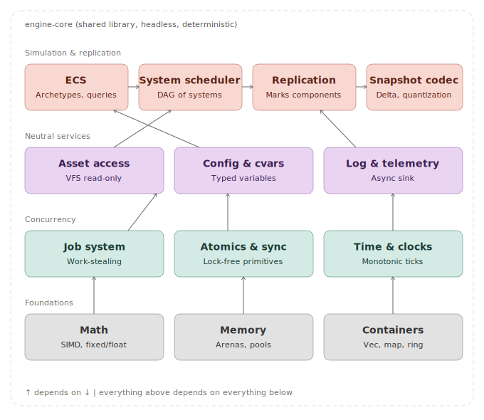
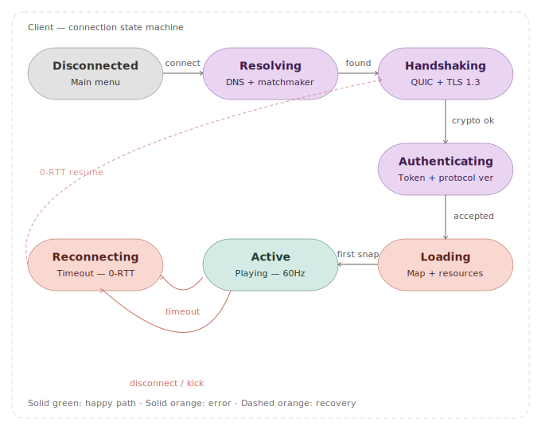
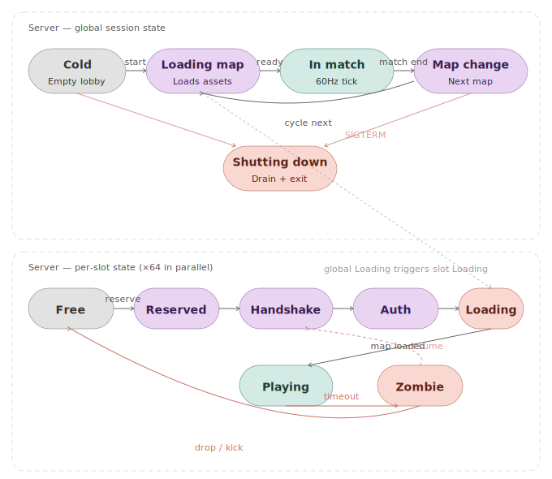
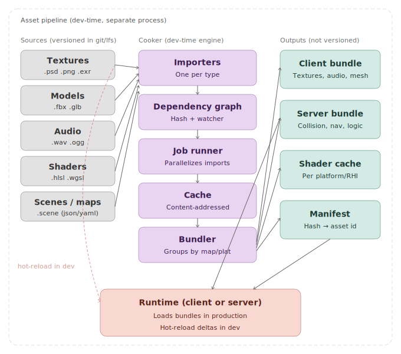
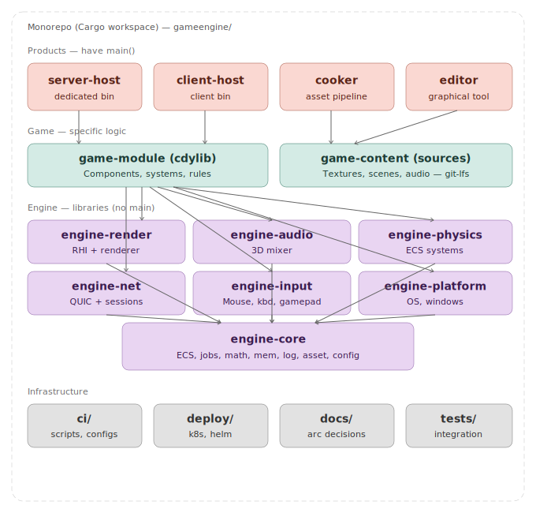
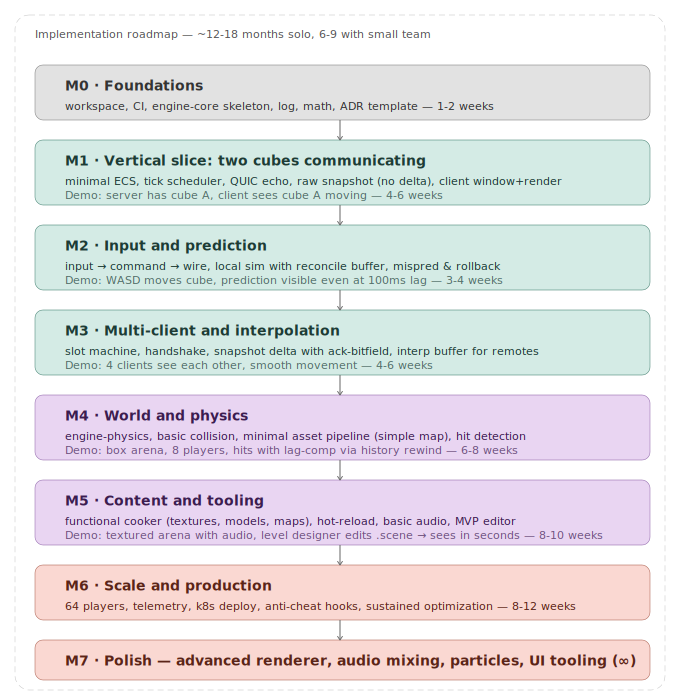

# Game Engine — Architecture

Living architecture document for the engine. Quake 2-style (authoritative client/server), with modern advances: archetype-based ECS, QUIC transport, hot-reload, deterministic asset pipeline.

**Status:** initial design — pre-implementation.
**Audience:** author + future contributors.
**Convention:** each section ends with decisions recorded as embedded ADRs. When a decision is "ratified" in code, extract it to `docs/adr/NNNN-title.md`.

---

## Executive summary

Multiplayer engine for arena games (up to 64 players @ 60Hz), with authoritative dedicated server and client featuring client-side prediction + server reconciliation. Modular Rust monorepo architecture, with a shared core library between client and server, and separate products (binaries) for each role. Dev-time asset pipeline decoupled from runtime, with hot-reload.

**Non-goals:** listen-server, peer-to-peer, MMO/large shards, pure offline single-player (offline runs a local dedicated server).

---

## Level 1 — Context

The actors and external systems the engine interacts with.


**Reading notes:**

- *Player* — input/output via client.
- *Developer* — writes game code + tooling.
- *Operator* — runs/monitors dedicated servers.
- *Platform* — OS, GPU, audio, controllers; abstracted via HAL/RHI.
- *Network* — packet transport (QUIC/UDP).
- *Online services* — auth, matchmaking, telemetry, CDN.

### ADR 0001 — Topology: dedicated server only

**Context:** multiple topologies possible (single-player, listen-server, dedicated, peer-to-peer).

**Decision:** support dedicated server only (separate, headless process). Offline single-player runs a local dedicated server on loopback.

**Alternatives:** listen-server (host is also a player, Quake 2 / CS 1.6 model) — rejected because it muddies the authority boundary and requires the client to be able to load the full simulation.

**Consequences:** authority 100% on server, always. Client is purely I/O terminal + prediction. Server compiles without GPU/audio/input.

### ADR 0002 — Target scale: arena ~64 players @ 60Hz

**Context:** scale influences everything (replication, area-of-interest, tickrate, networking).

**Decision:** primary target is arena/shooter up to 64 players @ 60Hz tickrate.

**Consequences:** snapshot-based networking with delta + ack-bitfield, client-side prediction, lag-comp via rewind in history buffer, no area-of-interest (everyone sees everyone). Not supported: MMO/large shards.

---

## Level 2 — Containers (runtime)

The processes that run in production and how they communicate.


**Key notes:**

- Commands and snapshots are distinct channels, not bidirectional. Commands = player input. Snapshots = world state with delta compression.
- Asset bundle is the *same* source but with distinct sub-bundles for client (meshes, textures, shaders, audio) and server (collision geometry, navmesh, gameplay data).
- Player and Operator have different trust boundaries — operator has RCON/admin on the server; player only sends limited inputs.

### ADR 0003 — Client/server communication: asymmetric on two channels

**Decision:** two distinct logical channels — commands (client→server) and snapshots (server→client). Both unreliable with sequence numbers.

**Rationale:** snapshots are idempotent in aggregate (tick N+1's overrides N's); reliability adds latency without adding correctness.

---

## Level 3 — Dedicated server components


**Categories (conceptual coloring):**

- **Network/validation (purple)** — `Net & session`, `Command pipeline`, `Snapshot builder`. Everything touching bytes or untrusted state.
- **Simulation core (teal)** — `Tick scheduler`, `World ECS`, `Simulation systems`, `History buffer`. All deterministic, source of truth.
- **Pluggable (coral)** — `Game module` (cdylib loaded at runtime).

**Cross-cutting concerns not shown:**

- Job system (parallelizes inside each system).
- Asset loader (loads bundle at map start).
- Telemetry (async sink).
- Anti-cheat (hooks in Command pipeline and Snapshot builder).

### ADR 0004 — Archetype-based ECS

**Decision:** ECS with archetypes (entities with the same set of components live in contiguous chunks), not sparse-set.

**Rationale:** bulk iteration (the simulation pattern) is the hot case; archetype layout is cache-friendly. References: Bevy ECS, Unity DOTS.

**Trade-off:** mutating a component set (`add_component`/`remove_component`) is more expensive (move between archetypes). Acceptable — it's rare on the hot path.

### ADR 0005 — Fixed 60Hz tick

**Decision:** server runs a fixed 16.67ms tick. Inputs arriving mid-tick wait for the next one. Client renderer is variable (independent).

**Rationale:** determinism. Client and server must produce identical results for identical inputs; physics with variable `dt` diverges.

### ADR 0006 — Game logic in hot-loadable cdylib

**Decision:** game logic lives in a dynamic library (`game-module`), loaded at runtime. In dev, supports unload+reload+state migration.

**Rationale:** fast iteration cycle (Quake's `game.dll` solved this in 1997).

**Risk in Rust:** unstable ABI → shared types must be FFI-safe (`#[repr(C)]` or via data format).

---

## Level 3 — Anatomy of a server tick (sequence)


**Invariants:**

1. `drain → apply → simulate` — all inputs ready before simulating.
2. Lag-comp happens *inside* simulate (rewind in History buffer).
3. `commit` before `snapshot` — history is source of truth for deltas.
4. `send` is N parallel sends (one per client).

**Typical per-tick budget (64 players, tuned):**

- drain + apply: 0.5–1ms
- simulate: 4–8ms (parallelizable)
- commit: <0.5ms
- snapshot + send: 1–3ms (parallelizable per client)
- cushion: 5–10ms

---

## Level 3 — Game client components


**Asymmetries vs. server:**

- Two rhythms: simulation (fixed 60Hz, mirror of the server) + render (variable, tied to display).
- Two entity categories: local player (prediction + reconciliation) and remotes (interpolation from snapshots).
- Renderer and audio engine *do not exist on the server*.

### ADR 0007 — Frame loop with accumulator-based timestep

**Decision:** client uses fixed-step accumulator (Gaffer on Games "Fix Your Timestep"). Simulation at fixed 60Hz; render at variable framerate, interpolating between the two latest ticks.

**Rationale:** decouples framerate from tickrate. Allows 144/240fps render in a 60Hz-sim game, with optimal responsiveness and consistency with the server.

---

## Level 3 — Engine core (shared library)



**Principles:**

1. **Determinism first** — all functions produce bit-identical results on all platforms for identical inputs.
2. **Headless by construction** — zero dependencies on window, GPU, audio, input.
3. **Zero dynamic allocation on the hot path** — arenas, pools, pre-allocated archetypes.
4. **Vertical dependencies only** — layer N only depends on N-1 and below.

**What's deliberately outside the core:** RHI/renderer, audio, input, network transport (lives in `engine-net`), physics (lives in `engine-physics`), editor.

### ADR 0008 — Math: IEEE float with strict ordering, fixed-point only where needed

**Decision:** IEEE 754 floats for most things; Q16.16 fixed-point *only* for networked player movement and physics.

**Rationale:** avoids holding productivity hostage to determinism where it doesn't matter (UI, audio, particles). Cost of the mixed approach: need for a clear boundary between types.

---

## Level 3 — Network protocol


**Packet structure (hot state):**

```
[seq:u16] [last_acked_remote:u16] [ack_bitfield:u32]
[tick:u32] [baseline_tick:u32]
[ bit-packed component deltas ... ]
```

**Typical quantization:**

- Positions: 16-bit per axis on a 4096-unit map → 0.0625 precision.
- Quaternions: smallest-three (index + 3×10 bits) → 4 bytes.
- Velocities: 12-bit.
- Presence bitmask: 64 bits per entity, RLE.

**Expected bandwidth budget:** ~30–60 KB/s downstream per client, ~5–10 KB/s upstream. 64-player server: ~2–4 MB/s downstream total.

### ADR 0009 — Transport: QUIC datagrams (hot) + QUIC streams (bulk)

**Decision:** QUIC with datagrams (RFC 9221) for hot state and streams for bulk. Mandatory TLS 1.3.

**Rationale:** gains encrypted handshake, mature congestion control, connection migration, 0-RTT on reconnects. Cost: ~16 bytes AEAD overhead per packet.

**Considered alternative:** UDP+DTLS+custom protocol (Q3/CS style). Rejected — reinvents what QUIC ships ready.

**Risk:** QUIC datagrams still have less maturity than streams. Fallback plan: revert to custom UDP+DTLS if benchmarks reveal excessive overhead.

### ADR 0010 — Reliability in the application layer for events

**Decision:** critical events (chat, kills, important changes) use a *reliable-unordered* channel implemented atop QUIC datagrams, *not* atop streams.

**Rationale:** streams create head-of-line blocking between unrelated events. Custom reliability is simple (number + retransmit until acked).

---

## Level 3 — Connection state machine (client)



**Notes:**

- `Authenticating` is separate from `Handshaking` — network crypto ≠ player identity.
- `Loading` is its own state, not a sub-phase of `Active` — during load there's no input nor world render.
- `Reconnecting` tries QUIC 0-RTT to resume the session without going back to the matchmaker.

## Level 3 — Server state machines (global session + slots)



**Key notes:**

- Server runs consecutive matches; doesn't restart the process between matches.
- `Reserved` prevents matchmaker race (promising N+1 players to an N-slot server).
- `Zombie` keeps the slot alive for 15-30s after connection loss — pairs with client's `Reconnecting`.

### ADR 0011 — Slot state machine as typed enum

**Decision:** each slot state is a variant of a typed enum with typed payload. Invalid transitions don't compile.

```rust
enum SlotState {
    Free,
    Reserved { token: SessionToken, since: Tick },
    Handshake { conn: QuicConn, since: Tick },
    Auth { conn: QuicConn, ident: PlayerId, since: Tick },
    Loading { conn: QuicConn, ident: PlayerId, entity: EntityId, since: Tick },
    Playing { conn: QuicConn, ident: PlayerId, entity: EntityId, last_seen: Tick },
    Zombie { ident: PlayerId, entity: EntityId, until: Tick },
}
```

**Rationale:** avoids a whole class of bugs where state is computed from other fields.

---

## Level 3 — Asset pipeline (dev-time)



**Principles:**

- Runtime never parses authoring formats. Loads ready-to-use bytes.
- Content-addressed cache: key = hash(importer_version + source + options).
- Shared remote cache (S3 or Bazel remote cache) — `git pull` inherits cookings from colleagues.
- Sources versioned (git+LFS); outputs not (`.gitignore`).
- Scenes in text (YAML/JSON) for PR diffs.

### ADR 0012 — Content-addressed, shared cooking cache

**Decision:** local cache + remote cache, indexed by hash of content + importer version + options.

**Rationale:** avoids the "wait 40 minutes on first launch after pull" anti-pattern. CI cooks releases and publishes to the remote cache.

### ADR 0013 — Scenes in text format

**Decision:** scene files in YAML (or JSON). Cooker processes to runtime-ready binary.

**Rationale:** diff-able in PRs. Editor *edits* the text file, not a proprietary binary.

---

## Level 3 — Monorepo structure



**Rules:**

- Product never depends on product.
- Engine libs never depend on each other (all → `engine-core`).
- `server-host` does *not* link `engine-render`/`engine-audio`/`engine-input` — compiles headless.

**Physical layout:**

```
gameengine/
├── Cargo.toml                  # workspace
├── engine-core/                # ECS, jobs, math, mem, log, asset, config
├── engine-net/                 # QUIC + sessions
├── engine-render/              # RHI + renderer
├── engine-audio/               # 3D mixer
├── engine-physics/             # physics ECS systems
├── engine-input/               # mouse, kbd, gamepad
├── engine-platform/            # OS, windows
├── game-module/                # cdylib — game logic
├── assets/                     # sources (NOT a crate); git-lfs
│   ├── maps/, textures/, audio/, models/, shaders/
│   └── .gitattributes
├── server-host/                # binary
├── client-host/                # binary
├── cooker/                     # binary
├── editor/                     # binary
├── ci/
├── deploy/                     # k8s, helm
├── docs/
│   ├── diagrams/               # SVG diagrams for this document
│   └── adr/                    # extracted ADRs
└── tests/                      # cross-crate integration
```

### ADR 0014 — Monorepo Cargo workspace

**Decision:** all engine + game + tools crates in a single Git repo, managed as a Cargo workspace.

**Rationale:** atomic refactors, hermetic build, single version across the entire stack.

**Alternative:** polyrepo. Rejected — coordination overhead unjustified at this scale.

### ADR 0015 — Language: Rust

**Decision:** Rust across the runtime stack.

**Rationale:** borrow checker eliminates classes of bugs in multi-threaded ECS, solid ecosystem (`wgpu`, `quinn` for QUIC, references like `bevy_ecs`), Cargo workspace tailor-made.

**Known cost:** hot-reload requires FFI-safe cdylib (`#[repr(C)]` types or serialization). Long compile times.

### ADR 0016 — ECS: hecs (not bevy_ecs)

Context: Three archetype-based ECS options for engine-core: bevy_ecs, hecs, flecs-rs. The decision shapes the entire engine since the ECS is its heart.

Decision: hecs as the foundation. Scheduler, change detection, command buffers, and reflection are implemented in engine-core as our own layer over hecs.

Rationale: Avoid architectural emergence via dependencies. bevy_ecs brings strong gravity toward the Bevy ecosystem; small "convenient" choices accumulate until the engine becomes a Bevy fork. hecs has no such gravity.
Inversion of control. Our engine must be the framework. Building on a library (hecs) rather than a framework (bevy_ecs) eliminates structural tension.
Comprehension as a reliability asset. ~5000 LOC of hecs is auditable. Production debugging at 60Hz × 64 players benefits from deep understanding of the scheduler.
API stability. hecs API has been stable for years. bevy_ecs breaks across major versions, with upgrade cost compounding.

Costs accepted: ~2-3 months of additional engineering across M1-M5 to build our own scheduler with DAG, change detection, command buffers, and reflection-light for snapshot serialization.
Smaller third-party ecosystem; less code to learn from.
No "drop-in" hot-reload — we implement it ourselves.

Rejected alternatives:

bevy_ecs — superior ecosystem and parallel scheduler out-of-the-box, but creates ecosystem coupling and ongoing API churn risk.
flecs-rs — FFI overhead and less rusty.
legion — unmaintained.

Reconsider if: by end of M3, our custom scheduler proves materially worse than bevy_ecs's under load, or development velocity is severely hampered. Migration cost would be high but bounded (queries and components are largely portable).

---

## Implementation roadmap



**Principles:**

1. **Vertical before horizontal** — thin slice touches the whole stack from M1.
2. **Demoable at every milestone.**
3. **Irreversible decisions first** (protocol, ECS layout, threading), optimizations last.

**Per-milestone detail:**

| M | Focus | Demoable deliverable |
|---|-------|----------------------|
| M0 | Workspace, CI, engine-core skeleton, log, math, ADR template | `cargo test` passes, empty binaries |
| M1 | Minimal ECS, tick scheduler, QUIC echo, raw snapshot (no delta), window+render | Server has cube A, client sees cube A moving |
| M2 | Input → command → wire, local sim with reconcile, rollback | WASD moves cube, prediction visible at 100ms lag |
| M3 | Slot machine, handshake, snapshot delta with ack-bitfield, interp buffer | 4 clients see each other, smooth movement |
| M4 | engine-physics, collision, minimal asset pipeline, hit-detection with lag-comp | Box arena, 8 players, hits with rewind |
| M5 | Functional cooker, hot-reload, basic audio, MVP editor | Textured arena with audio; edit .scene → see in seconds |
| M6 | 64 players, telemetry, k8s deploy, anti-cheat hooks, optimization | Full 64-player match in production |
| M7 | Advanced renderer, audio mixing, particles, UI tooling | Ongoing |

**Calibration:**

- Solo part-time (10-15h/week): ×3-4 on timings.
- Team of 2-3 full-time: ÷2 (not ÷3 — coordination costs).
- First engine project: +50%.

**Risks to watch:**

1. **M4 overruns** — lag-comp hit detection is the subtlest piece. Reserve buffer.
2. **M0 sprawls** — time-box at 2 weeks even if ugly.
3. **Platform multiplication in M5/M6** — focus on Windows or Linux until M6.
4. **Temptation to rewrite in M3-M4** — incremental refactor, not rewrite.

---

## Open decisions (to be closed in future milestones)

- **Supported client platforms** — Windows + Linux minimum. macOS, consoles: post-launch.
- **Editor: separate native app vs web/electron** — defer until M5.
- **External anti-cheat** — BattlEye/EAC integration only if there's an actual post-launch problem.
- **Replay/demo system** — possibly "free" if snapshots are persisted; ADR in M3.
- **Spectator mode** — sub-case of replay; depends.
- **In-game voice chat** — out of scope until M7.

---

## Glossary

- **ACK bitfield** — 32 bits sent in each packet indicating which recent packets were received.
- **Archetype** — grouping of entities sharing the same set of component types; contiguous in memory.
- **AEAD** — Authenticated Encryption with Associated Data; crypto primitive granting confidentiality + authenticity.
- **cdylib** — Rust dynamic library format with C-compatible ABI (loadable at runtime).
- **Delta compression** — sending only the difference between state N and state N-K (snapshot baseline).
- **ECS** — Entity-Component-System; architectural pattern where entities are IDs, components are pure data, systems are functions iterating over components.
- **HAL/RHI** — Hardware Abstraction Layer / Render Hardware Interface; abstraction over Vulkan/D3D12/Metal.
- **Lag compensation** — server rewinds the world in time (via History buffer) to validate actions the client took in its past.
- **Listen server** — host that is also a player (not supported, see ADR 0001).
- **Prediction (client-side)** — client simulates local player actions locally to hide latency; server corrects when mispredicted.
- **Reconciliation** — when client receives the authoritative server state for a tick it had already predicted, compare and re-simulate if differed.
- **Snapshot** — complete (or delta) world state at a specific tick, sent from server to client.
- **Tick** — discrete simulation step (16.67ms at 60Hz).
- **VFS** — Virtual File System; abstraction over asset sources (filesystem, bundle, network).

---

## Next steps

1. **Create repo** with the folder structure above. Don't write code yet.
2. **Extract ADRs** to `docs/adr/NNNN-title.md`. Make them official.
3. **Start M0** — Cargo workspace, CI, empty crate skeletons. Time-box: 2 weeks.
4. **Maintain this document.** Every big decision spawns a new ADR; this `architecture.md` is the index.

---

*Document generated from an iteratively conducted design session. Subject to revision as implementation discovers unforeseen realities.*
