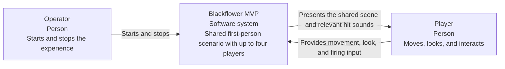
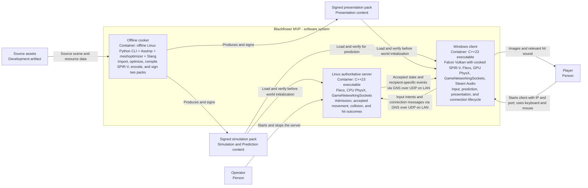
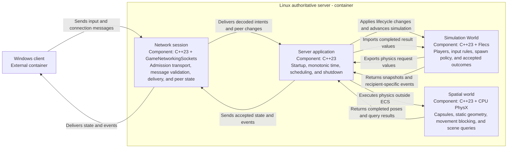
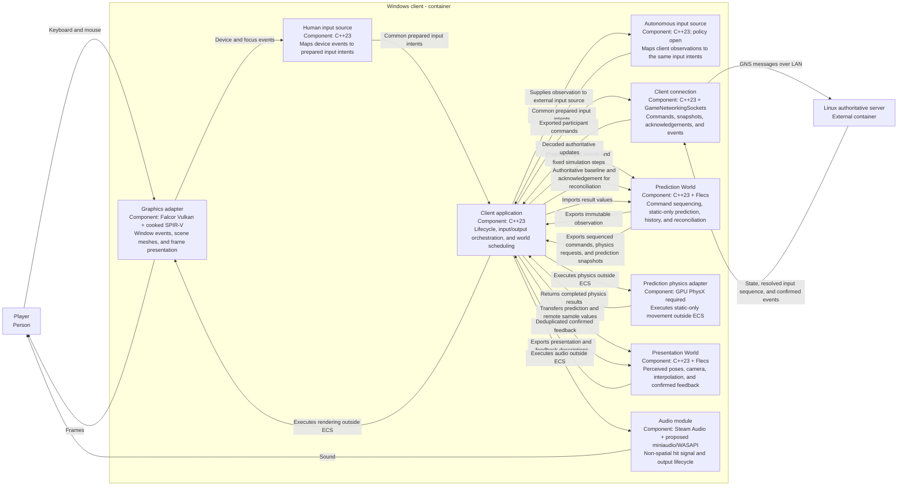
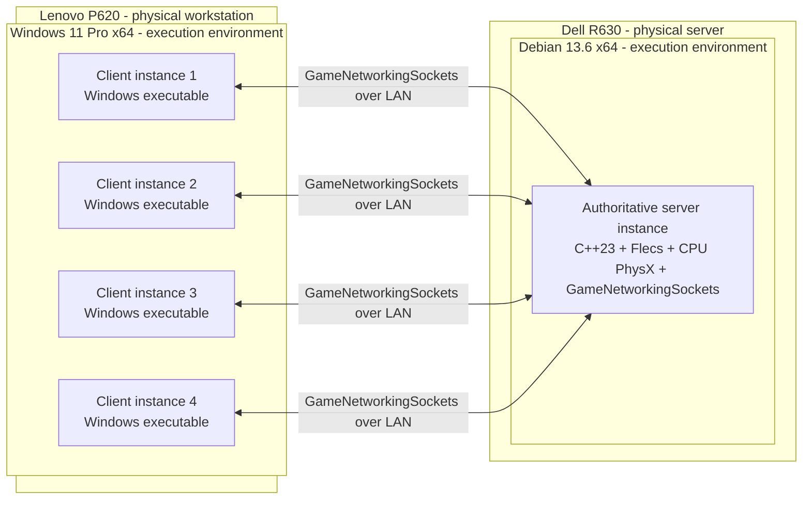

# Blackflower MVP: C4 architecture

Implemented subset: [#21](https://github.com/sergioffpc/blackflower/issues/21)
supplies the
[uv-managed OpenUSD cooker, signed primitive packs and C++ content loader](content-pipeline.md).
The rest of the runtime/SDK design below remains proposed. The content roles are
simulation and presentation; their extensions are `.bfsimulation` and
`.bfpresentation`.

Status: the owner selected the technology stack, two client worlds, and
interchangeable human/agent input, and GPU prediction against static geometry
only. The owner also approved the world phase ordering and requires no I/O
inside ECS execution. Detailed adapter integration remains proposed. No
simulation modules or runtime connections shown here have been implemented.
Confirmed MVP behavior comes from the
[specification](https://github.com/sergioffpc/blackflower/issues/11);
[technology integration](technology-stack.md) records selected libraries and
unresolved compatibility work.

These views complement arc42: context maps to section 3, software structure to
section 5, and deployment to section 7. In the C3 views, a C4 component
represents a proposed software module with a cohesive interface; this is
distinct from a Flecs ECS data component.

Notation: every element labels its type, name, and responsibility; technical
views also identify technology. Labelled arrows describe interaction or use.
Group boxes identify the software system, executable, or deployment machine in
scope. The diagrams use Mermaid flowcharts to express the C4 abstractions
without adding a separate diagram build tool.

## C1: system context

The operator runs the environment and the players interact with Blackflower. The
MVP requires no external account, matchmaking, or hosted service. This view
focuses on people and the system, following the
[C4 context guidance](https://c4model.com/diagrams/system-context).

## C2: containers

The runtime applications are the server and the client. An offline Python cooker
on Linux produces two signed packs per scenario, for simulation and
presentation. Their libraries execute inside those applications. See the
[C4 container guidance](https://c4model.com/diagrams/container) for this level
of responsibility and communication.

The two packs contain their required representations of the same scenario. Each
is independently signed. The server loads simulation content; clients load both
roles. Matching signed scenario build identities establish proposed admission
compatibility. The [cooker and pack proposal](cooker-and-packs.md) defines
offline production. The [runtime lifecycle](runtime-lifecycle.md) defines
loading, readiness, admission, and shutdown; pack verification never executes
inside ECS. Player state exists in server memory; each client holds separate
Prediction and Presentation Worlds. Human and autonomous input sources use the
same client container and protocol; agent policy and observation details remain
open. No persistence service is required. A client is a single container type
instantiated up to four times, as shown in the deployment view.

## C3: authoritative server components

The client graphics backend is [Vulkan-only](adr/0006-use-vulkan-only.md); the
server has no graphics backend.

This view zooms into the server executable, consistent with the
[C4 component guidance](https://c4model.com/diagrams/component). The application
verifies its pack before initialization and coordinates timing and lifecycle;
the Simulation World owns accepted state; physics owns spatial operations; the
network module owns connections and wire messages.

The Simulation World interface is also the principal deterministic test surface:
supply lifecycle/input actions and explicit elapsed time; inspect resulting
snapshots and events. World-only checks use prepared physics results and memory
output. Integration checks exercise the application-orchestrated Flecs/PhysX
path without requiring sockets, a window, or audio devices. Running-process
checks additionally exercise the network and application lifecycle.

The spatial module consumes the same dimensions and transforms used to construct
the visible scene and capsules. PhysX's internal pose representation and Flecs's
published state have one coordinated update path; they do not independently
decide a player's official position.

## C3: Windows client components

Each client contains two separate Flecs worlds: the **Prediction World**
advances provisional simulation and reconciles authoritative corrections; the
**Presentation World** prepares perceived state without affecting simulation.
The owner selected this separation and the common input interface in
[ADR-0002](adr/0002-separate-client-worlds-and-input.md). The diagram below
proposes their integration.

Before either client world is initialized, the application loads/verifies the
signed pack and prepares SDK resources outside ECS. No source-asset cooking runs
in the client. Exactly one input source controls a participant at a time. Both
sources enter the same command pipeline; neither directly edits a world or
bypasses server validation. The proposed agent observation is a read-only value
snapshot of client-visible simulation data, independent of visual interpolation.
Its contents and decision policy remain open. This design does not introduce a
separate agent simulation, transport, or headless deployment requirement.

The Prediction World owns provisional movement data and bounded unacknowledged
input history. A separate application-owned adapter holds its private physics
instance and executes SDK calls outside ECS progression. The server and client
share movement rules, dimensions, and coordinate conventions, not mutable
ECS/PhysX objects. Predict the local participant against static geometry only.
Dynamic objects and other players are received from the server; they do not
participate in local predicted collision response or autonomous extrapolation.
The server resolves player/player and other dynamic contacts and corrects the
local prediction. GPU integration and parity with the agreed movement behavior
still require proof.

The Presentation World consumes snapshots by value or immutable ownership
transfer. It can smooth corrections and interpolate remote players, but cannot
feed smoothed transforms back into prediction. Camera look follows the same
command-derived orientation for both input sources. Confirmed hit sounds are
deduplicated outside movement replay; a replay never resends a shot or repeats
an audible effect.

The proposed Falcor adapter keeps framework headers, handles, and error behavior
inside the graphics integration. Its
[exception-handling decision](adr/0001-isolate-falcor-exceptions.md) remains
open. Other modules receive project-owned values and explicit errors rather than
Falcor exceptions or types. The diagram expresses module interfaces, not a
requirement for abstract base classes or mock wrappers around every SDK.

## Deployment: reference acceptance environment

This view maps application instances onto the owner's machines, following the
[C4 deployment guidance](https://c4model.com/diagrams/deployment). Build tools
are development tooling, distinct from these runtime instances.

All four clients share the P620's GPU, CPU, and audio devices. The accepted
five-minute run requires each to keep rendering at 1920 by 1080, including when
unfocused. For human input, focus loss sends neutral movement and stops new
player commands while connection maintenance, reconciliation, and rendering
continue. Autonomous input is independent of window focus and uses an explicit
stop action. PhysX runs on the Dell's CPUs; each client's Prediction World must
use GPU PhysX against static geometry. Falcor and the four physics instances
share the P620 GPU, and the exact CUDA runtime/driver/package combination
remains unvalidated; the proposed server target has no rendering or audio
dependency.

## Proposed runtime and data contracts

| Concern          | Proposed contract                                                                                                                                                                                                                                                                                                                                                                                                                             |
| ---------------- | --------------------------------------------------------------------------------------------------------------------------------------------------------------------------------------------------------------------------------------------------------------------------------------------------------------------------------------------------------------------------------------------------------------------------------------------- |
| Content          | All runtime content comes from a verified signed cooked pack. An external startup loader provides immutable values and resource data before world initialization. The offline cooker is a development tool, not another world. See [ADR-0005](adr/0005-require-signed-cooked-content.md).                                                                                                                                                     |
| ECS execution    | No I/O in systems, observers, hooks, or transitive helpers. Worlds only transform memory values; application-owned adapters perform network, file/log, input/agent, physics/GPU, rendering, and audio operations. See [ADR-0004](adr/0004-keep-io-outside-ecs.md).                                                                                                                                                                            |
| State ownership  | The Simulation World owns admitted players and accepted poses. The client Prediction World owns provisional state; the separate Presentation World and Falcor objects represent perceived results. Neither client world changes official outcomes. Network identifiers are explicit project values, not Flecs IDs, pointers, or PhysX handles.                                                                                                |
| Collision scope  | The server resolves all collisions. The client predicts its own movement against static geometry only; dynamic poses come from the server and have no local collision response. Interpolation is presentation, not dynamic simulation.                                                                                                                                                                                                        |
| Shared geometry  | One fixed scene description and capsule dimensions feed authoritative physics, predicted physics, and rendering. Adapters perform coordinate/API conversions; the project specifies meters and one consistent coordinate convention before implementation.                                                                                                                                                                                    |
| Scheduling       | The Simulation World and Prediction World run at 240 Hz with fixed 1/240 s steps. Presentation targets 60 Hz with measured variable elapsed time. Use one writer per world; keep prediction scheduling independent of rendering. See the proposed [Flecs phase pipelines](flecs-phases.md) and [ADR-0003](adr/0003-world-update-rates.md). Network transmission cadence is a separate choice.                                                 |
| Message delivery | Use GNS reliable messages for admission and discrete events, and sequence-numbered replaceable input/state messages for ongoing updates. Define a bounded, versioned wire schema; reject stale state and retain reliable event ordering. Snapshots identify the server tick and last resolved input sequence, including rejected commands, so replay has an unambiguous baseline. GNS supplies transport, while Blackflower owns replication. |
| Input ordering   | The selected human or agent source emits the same movement/look/fire values. The common pipeline adds sequence/tick identity and sends the same commands it predicts. Human focus loss reliably communicates neutral input; autonomous control uses explicit stop. Repeated state updates and a bounded input-age policy prevent a lost neutral update from leaving movement active; its threshold is still to be specified.                  |
| Feedback         | The authoritative outcome explicitly identifies recipients. Only those clients trigger the agreed signal. The audio callback consumes prepared data and does not read or mutate the ECS world.                                                                                                                                                                                                                                                |
| Presentation     | Render local predicted movement and interpolate server-sampled remote movement. Reconcile prediction first; smooth corrections only in presentation. Measure actual movement-to-image and action-to-audio response against the existing 100 ms criterion.                                                                                                                                                                                     |
| Reconciliation   | Restore the server baseline, discard resolved inputs, and replay unresolved movement commands in order. Restore all state relevant to movement, including controller state and the static geometry revision; never assume restoring position alone is sufficient. Bound history and replay work; if the baseline is outside retained history, reset to fresh authoritative state. Exact bounds and correction tolerances remain open.         |
| Errors           | Network, physics, and audio interfaces report explicit errors. The unresolved Falcor exception proposal is confined to its adapter. Connection attempts and silent peers retain the specification's five-second behavior.                                                                                                                                                                                                                     |

These contracts are a concrete design proposal for discussion. The GPU movement
technique (standard CPU character-controller queries do not establish GPU
prediction), protocol representation, ability to sustain the required rates, and
SDK integration must pass the
[stack feasibility checks](technology-stack.md#evidence-required-before-the-first-delivery-can-rely-on-the-stack)
and the existing MVP criteria.

## Code-level detail and delivery mapping

C4's [code view](https://c4model.com/diagrams/code) is optional and can be
generated when implementation exists. This proposal stops at the module
interfaces and ownership rules needed to guide the seven approved deliveries.

-   [Enter the fixed scene](https://github.com/sergioffpc/blackflower/issues/12):
    establish the applications, offline cooker/signed pack and startup
    verification, graphics adapter, basic network session, and cross-build
    proof.
-   [Share player presence](https://github.com/sergioffpc/blackflower/issues/13):
    establish the Simulation World and both client worlds, player identity
    mapping, and the common geometry contract consumed by the physics
    integrations.
-   [Shared movement](https://github.com/sergioffpc/blackflower/issues/14):
    establish interchangeable input, local movement prediction, authoritative
    acknowledgement/reconciliation, and separate presentation, with human focus
    behavior and timing capture.
-   [Blocking collision](https://github.com/sergioffpc/blackflower/issues/15):
    integrate CPU server collision and GPU client prediction against static
    geometry, shared-geometry checks, and authoritative correction tests for
    player contact. Dynamic collision response stays exclusively on the server.
-   [Hit feedback](https://github.com/sergioffpc/blackflower/issues/16):
    implement the PhysX query path and client audio module while preserving
    recipient-specific feedback. It can use the common geometry contract
    independently of the movement-response work; the approved ticket dependency
    graph is unchanged.
-   [Connection failures](https://github.com/sergioffpc/blackflower/issues/17):
    complete the network/application lifecycle policies.
-   [Reference acceptance](https://github.com/sergioffpc/blackflower/issues/18):
    measure the integrated system on the reference deployment.

The published tickets predate the two-world decision. The mapping above records
the design impact; update the affected ticket descriptions and validation
criteria before implementation. An autonomous input adapter can be exercised
with a scripted policy; selecting production agent intelligence requires
separate scope. No GitHub ticket has been changed by this architecture update.

The approved [Flecs phases](flecs-phases.md) expand these module views into
world-level data transformations at a consistent abstraction level. Application
orchestration performs external operations between ECS segments, with explicit
state transfer and SDK completion rules.

The [phase contract proposal](phase-contracts.md) specifies the value data
exchanged at these interfaces, permitted world mutations, and request/result
identity rules. It is a logical schema proposal, not an implemented protocol or
a commitment to C++/SDK layouts.

The owner-selected product split is two C++ runtimes and one offline Python
tool. The [repository layout proposal](repository-layout.md) maps their
implementation and shared formats to directories.
