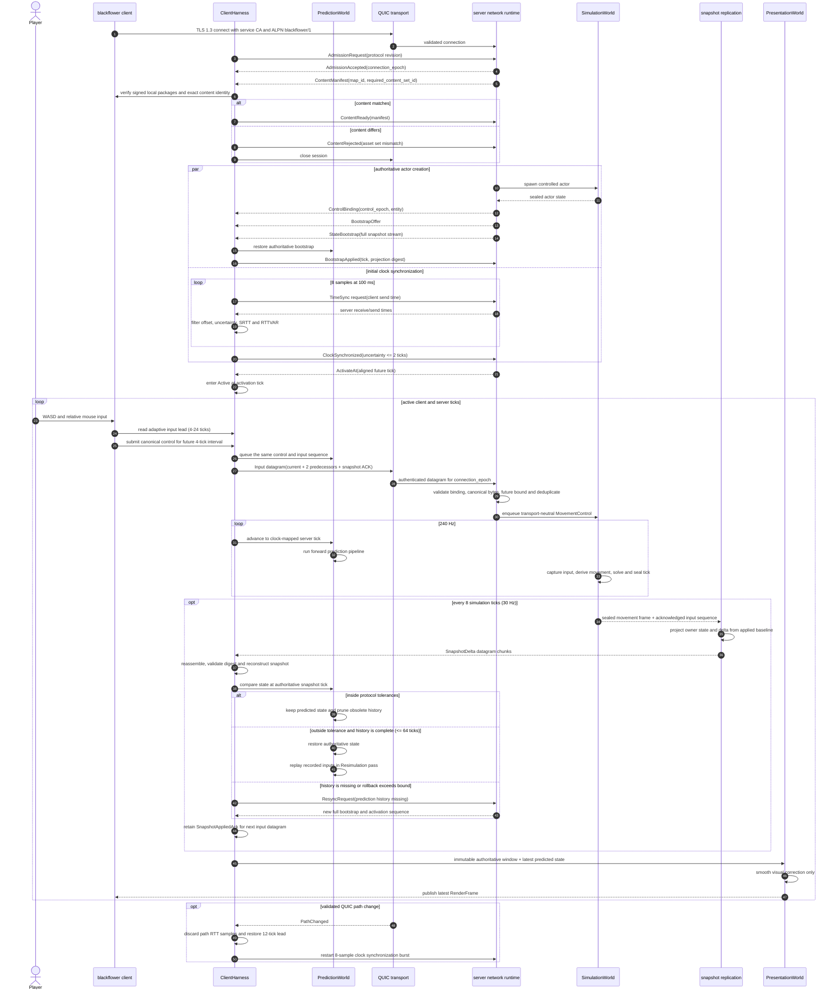

# Client-server movement flow

This document describes the implemented protocol-revision-1 path from native
client input to authoritative server state and back to the rendered client
proxy. The current gameplay schema contains movement and absolute view
orientation only.

## Implementation status

| Capability | Status | Implementation |
| --- | --- | --- |
| Authenticated connection and negotiation | Implemented | TLS 1.3 QUIC, ALPN `blackflower/1`, exact protocol revision, server-assigned connection epoch |
| Map and asset compatibility | Implemented | The server sends `ContentManifest`; the client accepts only an exact identity derived from locally signature-verified packages |
| Clock synchronization | Implemented | Eight initial four-timestamp samples, then one sample per second; validated path changes restart the burst |
| Movement latency compensation | Implemented | Controls are scheduled ahead by `srtt / 2 + 2 * rttvar`, aligned to four ticks and clamped to 4–24 ticks; the initial lead is 12 ticks |
| Movement protocol | Implemented | Canonical eight-byte movement/orientation control, monotonic input sequence, two redundant predecessors, control binding validation and deduplication |
| Client prediction | Implemented | The client advances the controlled movement state at 240 Hz using the prediction pipeline |
| Authoritative simulation | Implemented | The server consumes transport-neutral controls and seals movement state at 240 Hz |
| Snapshot replication | Implemented | Owner-filtered snapshots at 30 Hz, delta compression from an application-acknowledged baseline, chunk reassembly and full bootstrap/resync |
| Reconciliation | Implemented | Tolerance comparison, authoritative restore and input replay through the same prediction pipeline, bounded to 64 ticks |
| Presentation correction | Implemented | Corrected predicted movement is copied to a presentation-owned proxy and visually smoothed |
| Combat lag compensation | **Not implemented in revision 1** | `RewindRay`/`CatchUpBallistic` timing policy and simulation phases are extension points only; revision 1 registers `NoCommandsCodec` and has no fire, ray or projectile command schema |

“Lag compensation” therefore has two distinct meanings in this repository:

- movement latency is compensated now by synchronized clocks, adaptive future
  input scheduling, local prediction and authoritative reconciliation;
- server-side historical hit evaluation is not part of the current
  movement-only slice. It requires a versioned combat command schema,
  authoritative history representation and real resolvers before it can be
  described as implemented.

## End-to-end sequence

## Movement data and cadence

The application captures one schema-v1 control at 60 Hz. One control covers
four 240 Hz simulation ticks and contains normalized local right/forward axes,
absolute yaw and absolute pitch. The client sends the newest frame plus up to
two byte-identical predecessors in an unreliable QUIC datagram. Input
sequences never regress; exact duplicates are idempotent and conflicting
duplicates are protocol violations.

The server validates the connection epoch, server-issued control binding,
canonical movement bytes and 24-tick future bound before crossing the bounded
simulation ingress. The simulation never sees QUIC, datagrams or wire codecs.
It holds the last accepted movement control for at most 12 missing ticks and
then neutralizes movement while preserving absolute orientation.

The clock filter derives network delay from the four timestamps and maintains
smoothed RTT and RTT variance for the current path. A higher required lead
rebases the consecutive control timeline without exceeding the server's
12-tick input-hold grace in one jump; a lower lead is adopted without
overlapping already queued frames. A path change discards the path-specific
delay estimator, blocks temporal safety until fresh samples arrive and restores
the conservative 12-tick lead. Clock mapping itself remains monotonic.

## Reconciliation policy

At each authoritative snapshot tick the client compares its retained predicted
state with the server state. Revision 1 permits these continuous differences:

| Field | Tolerance |
| --- | ---: |
| Position | 0.02 m |
| Velocity | 0.05 m/s |
| Orientation | 0.5 degrees, shortest arc |

The controlled entity identity and grounded flag compare exactly. Tolerances
do not change canonical wire bytes, projection digests or replication
baselines.

If the comparison converges, histories older than the authoritative tick are
discarded. Otherwise the client restores that state and replays every retained
input through the same prediction pipeline in its `Resimulation` pass. Both
prediction and input history retain 512 ticks, but one correction is limited to
64 ticks. Missing history, a snapshot ahead of prediction or an excessive
rollback requests a full bootstrap instead of attempting a partial repair.

Presentation never feeds back into prediction or simulation. It consumes the
corrected predicted state, smooths the visible proxy and publishes an immutable
latest-wins render frame.

## Snapshot acknowledgement is not a QUIC ACK

A QUIC ACK only proves transport packet reception. `SnapshotAppliedAck` proves
that the client reconstructed and applied a specific snapshot tick with an
exact projection digest. The client piggybacks that application fact on its
next input datagram. Only then may the server promote that snapshot as the
baseline for future deltas.

## Ownership map

| Path | Ownership |
| --- | --- |
| [`crates/blackflower-networking-protocol`](../../crates/blackflower-networking-protocol) | Revision-1 component IDs, codecs, control bytes and tolerances |
| [`crates/blackflower-networking`](../../crates/blackflower-networking) | Session, wire framing, clock and timing policy |
| [`crates/blackflower-networking-quic`](../../crates/blackflower-networking-quic) | TLS/QUIC transport and bounded host queues |
| [`crates/blackflower-harness`](../../crates/blackflower-harness) | Client session, input redundancy, snapshots and prediction coordination |
| [`crates/blackflower-world-prediction`](../../crates/blackflower-world-prediction) | Prediction histories, reconciliation and forward/resimulation pipeline |
| [`crates/blackflower-world-simulation`](../../crates/blackflower-world-simulation) | Authoritative fixed-tick movement simulation |
| [`crates/blackflower-networking-replication`](../../crates/blackflower-networking-replication) | Owner projection baselines, deltas and snapshot chunks |
| [`apps/blackflower`](../../apps/blackflower) | Native input mapping and presentation integration |
| [`apps/blackflower-server`](../../apps/blackflower-server) | Network-to-simulation ingress and simulation-to-replication composition |

The normative wire requirements remain in
[`docs/networking-v1.md`](../networking-v1.md).
