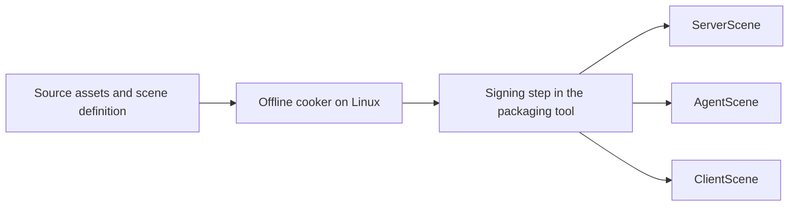

# MVP cooker and signed content packs

Status: the owner requires two C++ runtimes (client and server), one offline
Python cooker using Assimp for 3D model import and meshoptimizer for mesh
optimization before final-format conversion, Slang for offline shader
compilation to SPIR-V, and three verified, digitally signed content packs per
scenario. The minimal OpenUSD cooker, signed primitive pack format and C++
loader are implemented by
[#21](https://github.com/sergioffpc/blackflower/issues/21); see the
[implemented pipeline](content-pipeline.md). Mesh, shader, GPU physics and audio
processing below remain proposals for subsequent tickets. See
[ADR-0005](adr/0005-require-signed-cooked-content.md), [C4](c4.md), and
[the technology stack](technology-stack.md).

The [cooker specification](https://github.com/sergioffpc/blackflower/issues/19)
records the required outcomes and owner-confirmed production-to-consumption test
boundary. Detailed implementation proposals below remain distinct from approved
constraints.

## Content flow



The owner selected Python for the offline Linux CLI tool, `cooker`; the client
and server remain C++23. The cooker validates source assets and references,
produces portable runtime data, assembles a deterministic manifest, signs the
package, and verifies the finished artifact. Python and C++ loaders conform to
the same language-neutral format and shared test vectors; parser source code is
not assumed to be shared. The [repository layout proposal](repository-layout.md)
separates their source, packages, and build outputs. Signing is an explicit
packaging stage; runtime applications only need verification capabilities and
public keys.

The cooker derives complete ServerScene, AgentScene and ClientScene artifacts
from one source scene, using `.bfserver`, `.bfagent` and `.bfclient` extensions.
The server, autonomous participant and human client each select their own file.
The loader accepts a path and trusted keys without a role selector; each file
has its own authenticated magic. The loader returns a variant of the concrete
scene types, and consumers do not need companion packs.

ServerScene and AgentScene currently share collision geometry, without lights or
visual/audio assets. Only ServerScene contains spawn points. ClientScene
contains that geometry and the source lights, without spawn points. Visual mesh
and audio encoding remain future work. Runtime adapters prepare SDK resources
from these portable definitions. The autonomous participant will use the client
protocol; its runtime and model-driven control are outside this preparation.

## Selected cooker stack and model processing

| Responsibility             | Owner-selected technology | Role                                                                                                             |
| -------------------------- | ------------------------- | ---------------------------------------------------------------------------------------------------------------- |
| Language and orchestration | Python with uv            | Offline CLI, processing stages, validation, packaging, and signing orchestration.                                |
| Scene source               | OpenUSD                   | Read the self-contained USDA/USDC primitive scene through official Python bindings.                              |
| 3D model import            | Assimp                    | Read supported source models and expose their geometry, scene transforms, and material references to the cooker. |
| Mesh optimization          | meshoptimizer             | Optimize imported mesh data before conversion to the runtime format.                                             |
| Shader compilation         | Slang                     | Compile all required shader entry points and variants to SPIR-V offline for rendering resources.                 |

The canonical library name is `meshoptimizer`. Assimp exposes C/C++ interfaces
and Python bindings; its upstream PyAssimp wrapper uses `ctypes` and requires
the native shared library. The wrapper documents incomplete coverage, so its
availability is not proof of compatibility with the selected model features.
meshoptimizer exposes a C-compatible interface suitable for native interop.
Sources: [Assimp](https://github.com/assimp/assimp),
[PyAssimp](https://github.com/assimp/assimp/tree/master/port/PyAssimp),
[meshoptimizer](https://github.com/zeux/meshoptimizer).

The libraries are selected; Python bindings/FFI, exact native versions,
interpreter compatibility, supported input formats, and packaging remain to be
validated together on the Linux build host. These are offline cooker
dependencies. They do not introduce another product runtime or require the game
to import source models.

Proposed model path:

```text
Source model
  -> Assimp import
  -> validated canonical model data
  -> meshoptimizer optimization
  -> final runtime mesh encoding
  -> pack assembly, signature, and verification
```

The canonical intermediate model is cooker-owned memory, independent of Assimp
handles and the eventual runtime file layout. Normalize coordinate/scale
conventions and primitive representation once, preserve node transforms,
material partitions, and all required vertex attributes, and validate indices
and references before optimization. Missing materials or unsupported content
features are explicit cooking errors or documented conversion choices; they must
not disappear silently.

For the initial MVP, propose exact full-vertex deduplication, vertex-cache
ordering, then vertex-fetch ordering within compatible mesh/material partitions.
Remap every affected vertex attribute together and preserve triangle winding and
surface geometry. Overdraw ordering can be added where measured; simplification,
lossy quantization, LOD generation, meshlets, and encoded mesh compression are
separate choices rather than automatic consequences of selecting this library.
The upstream
[optimization pipeline](https://github.com/zeux/meshoptimizer#core-pipeline)
informs the ordering.

This starting policy preserves the agreed relationship between visible geometry,
static collision geometry, and hit queries. PhysX preparation consumes the same
validated scene geometry; render-buffer reordering must not change collision
dimensions or move surfaces. The pack stores the final prepared buffers; this
proposal does not require a meshoptimizer runtime decoder.

Record source hashes, Assimp/meshoptimizer and binding revisions,
import/optimization settings, and output-format version in cooking provenance.
Prove Python-to-native buffer ownership, repeated-build reproducibility,
attribute/material preservation, and consumption of the final pack by the C++
loader. Assimp and meshoptimizer integration is outside the implemented
primitive slice.

## Offline shader compilation

The Python cooker invokes a pinned Linux-host Slang compiler to produce SPIR-V
modules, with entry-point, stage, binding/reflection, specialization, and
target-capability metadata needed by the runtime. Source shaders and includes
are cooking inputs. Enumerate and cook all required MVP shader variants; missing
variants fail preparation rather than triggering runtime compilation. Record
compiler revision, arguments, include dependencies, and target profile in
provenance. Slang documents the `spirv` output target in its
[getting-started guide](https://docs.shader-slang.org/en/stable/external/slang/docs/user-guide/01-get-started.html).

SPIR-V is the selected delivered shader format. Vulkan is the only permitted
graphics backend, as required by [ADR-0006](adr/0006-use-vulkan-only.md);
[Falcor 8.0](https://github.com/NVIDIAGameWorks/Falcor/blob/8.0/README.md)
advertises Vulkan support, but loading these precompiled modules and their
metadata without invoking its runtime compiler remains unproven. Validate the
pinned Slang version, SPIR-V/Vulkan profile, resource layouts, and
cross-compiled client on the P620. Creating device shader modules and pipelines
remains an external runtime operation; source compilation belongs to the cooker.

## What is cooked

| Content   | Pack data                                                                                                                                     | Runtime operation allowed after validation                                             |
| --------- | --------------------------------------------------------------------------------------------------------------------------------------------- | -------------------------------------------------------------------------------------- |
| Scenario  | Geometric primitives, lights, spawn points, stable resource identities, and validated references                                              | Instantiate project-owned scene values and ECS entities.                               |
| Rendering | Prepared mesh buffers, material parameters, and any required texture data in a selected runtime format                                        | Create/upload resources through the external Falcor adapter.                           |
| Physics   | Validated primitive definitions; pre-cooked mesh data only where the chosen physics representation needs it, including GPU data when required | Create PhysX scenes/shapes from prepared representations; no mesh cooking from source. |
| Shading   | Offline Slang-compiled SPIR-V modules and required binding/reflection metadata for the client Vulkan/Slang profile                            | Create shader/pipeline resources using those artifacts.                                |
| Audio     | The short hit signal as prepared PCM with explicit sample format, rate, and channel count                                                     | Create playback buffers in the external audio adapter.                                 |

Analytic primitives are encoded directly without a mesh-cooking stage.
Participant dimensions belong to participant configuration. The source and
cooked schemas have explicit versions and conversions. No scene importer,
source-shader compiler, texture converter, or PhysX mesh cooker runs in the
delivered MVP application path. Driver processing required to create GPU
resources is distinct from application asset cooking; normal resource
initialization remains necessary.

Falcor's previously inspected path invokes Slang at runtime, so consumption of
precompiled shader artifacts is an additional feasibility requirement, not an
established feature of this integration. Prove the appropriate load path or
adapt it before claiming cooked-only startup. Linux-host preparation of Windows
shader/PhysX GPU artifacts must use the selected toolchain and target formats.
PhysX describes cooked mesh formats in its
[geometry documentation](https://nvidia-omniverse.github.io/PhysX/physx/5.5.0/docs/Geometry.html);
exact target/version compatibility still needs testing.

## Implemented primitive pack format

[Pack v1](../schemas/pack/v1.md) is the normative byte contract: explicit
little-endian fields, a canonical manifest, one primitive scenario payload,
SHA-256 digests and a detached Ed25519 signature over the exact header/manifest
transcript. [Scene v1](../schemas/scene/v1.md) defines OpenUSD authoring and the
runtime primitive layout. The C++ loader owns the bytes it verifies and returns
a complete value only after structural, cryptographic and scene validation.
Failures are typed values, with diagnostic text rendered separately. There are
no policy byte caps on source files, packs, manifests or provenance;
[ADR-0009](adr/0009-typed-errors-and-content-size-policy.md) records the
decision and reader compatibility.

Python uses cryptography 46.0.5; C++ uses libsodium 1.0.22#1 through vcpkg and a
scoped Windows cross-build overlay.
[ADR-0007](adr/0007-minimal-pack-format-and-trust.md) records these selections,
replacing the earlier OpenSSL EVP proposal for the C++ loader. Independent
literal-encoded reference fixtures check the two implementations. The artifact
extensions are `.bfserver`, `.bfagent` and `.bfclient`.

## Scenario compatibility

Each pack header contains a `ContentBuildId`, derived from source and settings
provenance and all three packs' cooked resource summaries in server/agent/client
order. Signatures and the build identifier itself are excluded from the build
transcript. The exact encoding is specified in pack v1.

Admission compares `ContentBuildId`; signing-key changes need not change the
content build identity. The loader validates resource schemas and authenticates
the build identity. The cooker recomputes it before publication. Rejecting peers
with a different build remains a subsequent admission responsibility. Scene
revision alone does not identify the complete build.

## Signing trust and production contracts

A dedicated content-signing private key belongs to the packaging environment,
outside the repository and distributed artifacts. It is separate from Git commit
signing. The runtime has an independently provisioned trusted public-key set; a
key embedded in a pack cannot authorize itself. The loader accepts an externally
supplied trust set; the harness reads a caller-selected raw public-key file.
Production executable provisioning and rotation remain future deployment
choices. Automated tests use disposable signing keys; only public keys and
signed reference artifacts are committed.

| Logical contract | Input                                                                             | Output and owner                                                                             |
| ---------------- | --------------------------------------------------------------------------------- | -------------------------------------------------------------------------------------------- |
| Cook content     | `CookRequest`: source set, scene definition, pinned tool settings                 | Three `CookedContentSet` values and a common build description, owned by the offline cooker. |
| Package/sign     | Cooked resources, canonical manifest with `ContentBuildId`, signing configuration | Three signed artifacts and their verification results, owned by packaging.                   |

Publish the set only after verification of all signatures, the common build
identity and scene values. A failed cook or signing step must not publish
incomplete content as a successful build. The
[runtime lifecycle](runtime-lifecycle.md#content-preparation-boundary) owns
verification/loading, SDK preparation, and world initialization; these are not
cooker responsibilities.

## MVP validation and delivery impact

The first playable slice needs the signed pack set, verified loading and
resource initialization. Functional checks cover production, consumption and
preservation of the authored scene. Follow the
[current test scope](development-process.md#current-application-test-scope).

Run the delivered applications without source assets available and establish
that no application asset cooking occurs. Exercise actual GPU physics and
precompiled shader loading on the P620. Record startup cost separately from the
accepted five-minute performance run. Signing establishes content origin under
the chosen trust key; cooking repeatability and runtime compatibility require
their own evidence.

Outstanding work includes production public-key provisioning, portable resource
schemas, Assimp/meshoptimizer bindings and exact versions, native SDK tool
integration, and the Falcor precompiled-shader path. The required outcome is
three verified, signed content packs per scenario, including offline
Slang-compiled SPIR-V resources.
