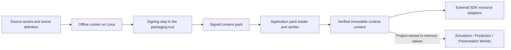

# MVP cooker and signed content packs

Status: the owner requires offline-cooked data in a verified, digitally signed pack for the MVP. The implementation design below is proposed; no cooker, signing key, pack, or loader has been implemented. See [ADR-0005](adr/0005-require-signed-cooked-content.md), [C4](c4.md), and [the technology stack](technology-stack.md).

## Content flow

Propose one Linux CLI tool, `blackflower-cooker`, implemented under the existing C++23/Clang build conventions. It validates source assets and references, produces target-ready data, assembles a deterministic manifest, signs the package, and verifies the finished artifact with the same parsing/verification logic used by the runtime. Signing is an explicit packaging stage; runtime applications only need verification capabilities and public keys.

The initial artifact is one `mvp.bfpack`, containing the common scenario and required target-specific sections for both Linux CPU simulation and Windows GPU prediction/presentation. The server validates the artifact but instantiates only server resources; the pack does not make Falcor or audio a server dependency. Separate target packs can be considered later without changing the common scene contract.

## What is cooked

| Content | Pack data | Runtime operation allowed after validation |
| --- | --- | --- |
| Scenario | Fixed geometry, spawn positions, player capsule dimensions, stable resource identities, and validated references | Instantiate project-owned scene values and ECS entities. |
| Rendering | Prepared mesh buffers, material parameters, and any required texture data in a selected runtime format | Create/upload resources through the external Falcor adapter. |
| Physics | Validated primitive definitions; pre-cooked mesh data only where the chosen physics representation needs it, including GPU data when required | Create PhysX scenes/shapes from prepared representations; no mesh cooking from source. |
| Shading | Offline-compiled shader artifacts and required binding/reflection metadata for the chosen backend/Slang revision | Create shader/pipeline resources using those artifacts. |
| Audio | The short hit signal as prepared PCM with explicit sample format, rate, and channel count | Create playback buffers in the external audio adapter. |

The simple boxes and capsules do not require an invented mesh-cooking stage: their validated dimensions are cooked scenario data. The source and cooked schemas have explicit versions and conversions. No scene importer, source-shader compiler, texture converter, or PhysX mesh cooker runs in the delivered MVP application path. Driver processing required to create GPU resources is distinct from application asset cooking; normal resource initialization remains necessary.

Falcor's previously inspected path invokes Slang at runtime, so consumption of precompiled shader artifacts is an additional feasibility requirement, not an established feature of this integration. Prove the appropriate load path or adapt it before claiming cooked-only startup. Linux-host preparation of Windows shader/PhysX GPU artifacts must use the selected toolchain and target formats. PhysX describes cooked mesh formats in its [geometry documentation](https://nvidia-omniverse.github.io/PhysX/physx/5.5.0/docs/Geometry.html); exact target/version compatibility still needs testing.

## Pack structure and signature proposal

Propose a versioned, uncompressed pack for the small MVP: a fixed-format header, bounded canonical manifest, contiguous asset payloads, and a signature record. Define byte order, integer widths, lengths, layout, and canonical encoding before implementation. Do not sign a reserialized interpretation that could differ from the bytes actually parsed.

| Part | Required proposed fields |
| --- | --- |
| Header | Magic, pack-format version, total length, manifest/payload/signature locations and lengths, algorithm suite, and signing-key identifier. |
| Manifest | Scene revision, cooker version/settings, target and SDK compatibility, and sorted unique entries containing resource identity, content type, schema version, target role, offset, size, dependencies, and SHA-256 payload digest. |
| Payload | Prepared content bytes; every byte belongs to a declared entry or defined canonical padding. |
| Signature | Ed25519 signature over a fixed Blackflower pack domain label plus the exact header and canonical manifest bytes. Signature bytes themselves are excluded. |

The authenticated manifest binds payload hashes, resource identities, targets, layout, and compatibility metadata. Changing a payload fails its digest check; changing a digest or metadata invalidates the signature. `PackId` is proposed as SHA-256 of the authenticated header/manifest transcript, computed rather than recursively stored inside that transcript. The algorithm suite is fixed by the supported pack version; an untrusted file cannot select arbitrary algorithms.

Use OpenSSL EVP for SHA-256 and Ed25519 rather than implementing cryptographic primitives. This is a proposed supporting dependency and should be declared directly for the tool/loader, even if another selected library also brings OpenSSL transitively. The standard library does not supply these cryptographic operations. Primary references: [OpenSSL Ed25519](https://docs.openssl.org/3.5/man7/EVP_SIGNATURE-ED25519/), [OpenSSL SHA-2](https://docs.openssl.org/3.5/man7/EVP_MD-SHA2/). The exact dependency pin and pack encoding remain to be agreed.

## Trust and startup verification

A dedicated content-signing private key belongs to the packaging environment, outside the repository and distributed artifacts. It is separate from Git commit signing. The runtime has an independently provisioned trusted public-key set; a key embedded in the pack cannot authorize itself. For the MVP, propose compiling the trusted public key into both executables. Key rotation/revocation then requires an explicit trust-set update; no key has been generated by this design work.

The external loader performs this sequence before publishing any content or creating the worlds:

1. Read a bounded artifact and validate fixed-header syntax, file size, ranges, overflow, manifest limits, duplicate identities, and supported format. Avoid unchecked allocations and traversal/extraction of asset paths.
2. Resolve the key identifier against the runtime trust set and verify the signature over the exact header/manifest transcript.
3. Validate all declared payload digests, layout/padding, resource schemas, references, scene invariants, and SDK/target compatibility. Signed content still requires structural and semantic validation.
4. Publish `VerifiedPack` and immutable `RuntimeContent` only when all checks succeed. The small MVP loads and verifies the whole pack once at startup; no partial trusted view escapes earlier.
5. Create SDK resources outside ECS, then supply validated scene/configuration values to world initialization. A resource-creation failure prevents entering gameplay.

The retained immutable bytes must be the bytes actually checked. Do not verify a pathname and later reopen potentially changed data for consumption. Reject missing packs, unknown keys, invalid signatures/hashes, truncation, unsupported variants, or inconsistent scene data with an explicit external startup error. No fallback to unsigned packs or loose source files is permitted for the MVP.

Propose comparing the exact verified `PackId` during connection admission, before spawn. A client with another pack is refused with a content-mismatch reason. This establishes version agreement between cooperating runtimes; a client's claimed identity is not remote attestation of its process. Verification is local to each runtime. Initial connection timing starts after local pack/resource preparation; the server loads its pack before accepting sessions.

## Data contracts and ECS integration

| Logical contract | Input | Output and owner |
| --- | --- | --- |
| Cook content | `CookRequest`: source set, scene definition, target profiles, pinned tool settings | `CookedContentSet`, owned by the offline cooker. |
| Package/sign | Cooked content, canonical manifest, and signing configuration | `SignedPackArtifact` plus build/verification report, owned by packaging. |
| Verify/load | Artifact bytes, independently trusted public keys, limits, and runtime compatibility profile | `VerifiedPack` or explicit failure; owned by the application loader. |
| Prepare runtime | Verified prepared payloads | Immutable `RuntimeContent` and separate adapter-owned SDK resources. |
| Initialize worlds | Validated scene/rule values and content identity | Initial ECS state; no file, signature, decoder, or SDK operation executes here. |

`RuntimeContent` supplies the `SceneDefinition` and project resource identities referenced by the [phase contracts](phase-contracts.md). Worlds receive the verified pack identity as session/configuration data. Existing `SceneRevision` labels geometry compatibility; `PackId` identifies the complete authenticated content set. This is startup tooling and application orchestration, not an eighteenth ECS phase or a fourth world.

## MVP validation and delivery impact

The first playable slice now needs a cooked and signed pack, loader verification, and resource initialization from that pack. Update the affected specification/tickets before implementation. Validate positive loading on Linux and Windows, altered payload/manifest/signature rejection, unknown-key rejection, malformed ranges and duplicate entries, incompatible target/SDK rejection, and content mismatch before admission. Use disposable test keys for automated checks.

Run the delivered applications without source assets available and establish that no application asset cooking occurs. Exercise actual GPU physics and precompiled shader loading on the P620. Record startup cost separately from the accepted five-minute performance run. Signing establishes content origin under the chosen trust key; cooking repeatability and runtime compatibility require their own evidence.

Outstanding proposals are the byte-level format and limits, Ed25519/SHA-256/OpenSSL selection, public-key provisioning, target artifact profiles, and the Falcor precompiled-shader path. The required outcome remains a verified, signed pack of cooked data in the MVP.
