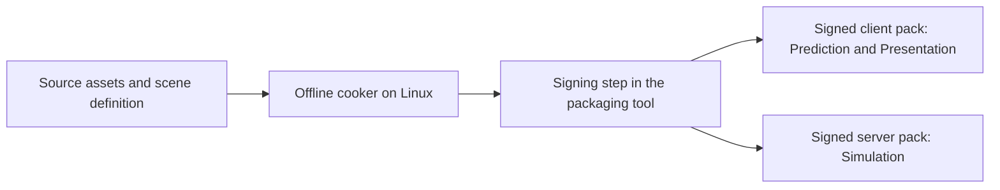

# MVP cooker and signed content packs

Status: the owner requires two C++ runtimes (client and server), one offline Python cooker using Assimp for 3D model import and meshoptimizer for mesh optimization before final-format conversion, Slang for offline shader compilation to SPIR-V, and two verified, digitally signed packs per scenario: one for the client and one for the server. The implementation design below is proposed; no cooker, signing key, pack, or loader has been implemented. See [ADR-0005](adr/0005-require-signed-cooked-content.md), [C4](c4.md), and [the technology stack](technology-stack.md).

The [cooker specification](https://github.com/sergioffpc/blackflower/issues/19) records the required outcomes and owner-confirmed production-to-consumption test boundary. Detailed implementation proposals below remain distinct from approved constraints.

## Content flow



The owner selected Python for the offline Linux CLI tool, `blackflower-cooker`; the client and server remain C++23. The cooker validates source assets and references, produces target-ready data, assembles a deterministic manifest, signs the package, and verifies the finished artifact. Python and C++ loaders conform to the same language-neutral format and shared test vectors; parser source code is not assumed to be shared. The [repository layout proposal](repository-layout.md) separates their source, packages, and build outputs. Signing is an explicit packaging stage; runtime applications only need verification capabilities and public keys.

The cooker produces exactly two self-contained packs per scenario: `<scenario>.client.bfpack` for Prediction and Presentation, and `<scenario>.server.bfpack` for Simulation. Each has its own manifest, payload hashes, signature, and target role. Each runtime receives and verifies only its own pack; neither needs to read the other pack or a third shared pack. Common scene/rule values required by both are included in both, derived from the same validated scenario input. The proposed MVP filenames are `mvp.client.bfpack` and `mvp.server.bfpack`.

The client pack contains static collision data for GPU prediction plus presentation meshes, materials, textures, SPIR-V shaders, and audio. The server pack contains authoritative scene, spawn/rule, collision, and interaction data for CPU simulation, including dynamic participant definitions. It contains no presentation meshes, materials, textures, shaders, or audio solely needed for presentation. Shared player dimensions and resource identities remain consistent; packing static geometry in both representations does not authorize client-side dynamic simulation.

## Selected cooker stack and model processing

| Responsibility | Owner-selected technology | Role |
| --- | --- | --- |
| Language and orchestration | Python | Offline CLI, processing stages, validation, packaging, and signing orchestration. |
| 3D model import | Assimp | Read supported source models and expose their geometry, scene transforms, and material references to the cooker. |
| Mesh optimization | meshoptimizer | Optimize imported mesh data before conversion to the runtime format. |
| Shader compilation | Slang | Compile all required shader entry points and variants to SPIR-V offline for the client pack. |

The canonical library name is `meshoptimizer`. Assimp exposes C/C++ interfaces and Python bindings; its upstream PyAssimp wrapper uses `ctypes` and requires the native shared library. The wrapper documents incomplete coverage, so its availability is not proof of compatibility with the selected model features. meshoptimizer exposes a C-compatible interface suitable for native interop. Sources: [Assimp](https://github.com/assimp/assimp), [PyAssimp](https://github.com/assimp/assimp/tree/master/port/PyAssimp), [meshoptimizer](https://github.com/zeux/meshoptimizer).

The libraries are selected; Python bindings/FFI, exact native versions, interpreter compatibility, supported input formats, and packaging remain to be validated together on the Linux build host. These are offline cooker dependencies. They do not introduce another product runtime or require the game to import source models.

Proposed model path:

```text
Source model
  -> Assimp import
  -> validated canonical model data
  -> meshoptimizer optimization
  -> final runtime mesh encoding
  -> pack assembly, signature, and verification
```

The canonical intermediate model is cooker-owned memory, independent of Assimp handles and the eventual runtime file layout. Normalize coordinate/scale conventions and primitive representation once, preserve node transforms, material partitions, and all required vertex attributes, and validate indices and references before optimization. Missing materials or unsupported content features are explicit cooking errors or documented conversion choices; they must not disappear silently.

For the initial MVP, propose exact full-vertex deduplication, vertex-cache ordering, then vertex-fetch ordering within compatible mesh/material partitions. Remap every affected vertex attribute together and preserve triangle winding and surface geometry. Overdraw ordering can be added where measured; simplification, lossy quantization, LOD generation, meshlets, and encoded mesh compression are separate choices rather than automatic consequences of selecting this library. The upstream [optimization pipeline](https://github.com/zeux/meshoptimizer#core-pipeline) informs the ordering.

This starting policy preserves the agreed relationship between visible geometry, static collision geometry, and hit queries. PhysX preparation consumes the same validated scene geometry; render-buffer reordering must not change collision dimensions or move surfaces. The pack stores the final prepared buffers; this proposal does not require a meshoptimizer runtime decoder.

Record source hashes, Assimp/meshoptimizer and binding revisions, import/optimization settings, and output-format version in cooking provenance. Prove Python-to-native buffer ownership, repeated-build reproducibility, attribute/material preservation, and consumption of the final pack by the C++ loader. No native package or binding has been installed by this documentation change.

## Offline shader compilation

The Python cooker invokes a pinned Linux-host Slang compiler to produce SPIR-V modules, with entry-point, stage, binding/reflection, specialization, and target-capability metadata needed by the runtime. Source shaders and includes are cooking inputs. Enumerate and cook all required MVP shader variants; missing variants fail preparation rather than triggering runtime compilation. Record compiler revision, arguments, include dependencies, and target profile in provenance. Slang documents the `spirv` output target in its [getting-started guide](https://docs.shader-slang.org/en/stable/external/slang/docs/user-guide/01-get-started.html).

SPIR-V is the selected delivered shader format. Vulkan is the only permitted graphics backend, as required by [ADR-0006](adr/0006-use-vulkan-only.md); [Falcor 8.0](https://github.com/NVIDIAGameWorks/Falcor/blob/8.0/README.md) advertises Vulkan support, but loading these precompiled modules and their metadata without invoking its runtime compiler remains unproven. Validate the pinned Slang version, SPIR-V/Vulkan profile, resource layouts, and cross-compiled client on the P620. Creating device shader modules and pipelines remains an external runtime operation; source compilation belongs to the cooker.

## What is cooked

| Content | Pack data | Runtime operation allowed after validation |
| --- | --- | --- |
| Scenario | Fixed geometry, spawn positions, player capsule dimensions, stable resource identities, and validated references | Instantiate project-owned scene values and ECS entities. |
| Rendering | Prepared mesh buffers, material parameters, and any required texture data in a selected runtime format | Create/upload resources through the external Falcor adapter. |
| Physics | Validated primitive definitions; pre-cooked mesh data only where the chosen physics representation needs it, including GPU data when required | Create PhysX scenes/shapes from prepared representations; no mesh cooking from source. |
| Shading | Offline Slang-compiled SPIR-V modules and required binding/reflection metadata for the client Vulkan/Slang profile | Create shader/pipeline resources using those artifacts. |
| Audio | The short hit signal as prepared PCM with explicit sample format, rate, and channel count | Create playback buffers in the external audio adapter. |

The simple boxes and capsules do not require an invented mesh-cooking stage: their validated dimensions are cooked scenario data. The source and cooked schemas have explicit versions and conversions. No scene importer, source-shader compiler, texture converter, or PhysX mesh cooker runs in the delivered MVP application path. Driver processing required to create GPU resources is distinct from application asset cooking; normal resource initialization remains necessary.

Falcor's previously inspected path invokes Slang at runtime, so consumption of precompiled shader artifacts is an additional feasibility requirement, not an established feature of this integration. Prove the appropriate load path or adapt it before claiming cooked-only startup. Linux-host preparation of Windows shader/PhysX GPU artifacts must use the selected toolchain and target formats. PhysX describes cooked mesh formats in its [geometry documentation](https://nvidia-omniverse.github.io/PhysX/physx/5.5.0/docs/Geometry.html); exact target/version compatibility still needs testing.

## Pack structure and signature proposal

Propose a versioned, uncompressed pack for the small MVP: a fixed-format header, bounded canonical manifest, contiguous asset payloads, and a signature record. Define byte order, integer widths, lengths, layout, and canonical encoding before implementation. Do not sign a reserialized interpretation that could differ from the bytes actually parsed.

| Part | Required proposed fields |
| --- | --- |
| Header | Magic, pack-format version, total length, manifest/payload/signature locations and lengths, algorithm suite, and signing-key identifier. |
| Manifest | Scenario identity, scenario build identity, scene revision, pack role, cooker version/settings, target and SDK compatibility, and sorted unique entries containing resource identity, content type, schema version, target role, offset, size, dependencies, and SHA-256 payload digest. |
| Payload | Prepared content bytes; every byte belongs to a declared entry or defined canonical padding. |
| Signature | Ed25519 signature over a fixed Blackflower pack domain label plus the exact header and canonical manifest bytes. Signature bytes themselves are excluded. |

The authenticated manifest binds payload hashes, resource identities, targets, layout, and compatibility metadata. Changing a payload fails its digest check; changing a digest or metadata invalidates the signature. `PackId` is proposed as SHA-256 of the authenticated header/manifest transcript, computed rather than recursively stored inside that transcript. The algorithm suite is fixed by the supported pack version; an untrusted file cannot select arbitrary algorithms.

Propose OpenSSL EVP for SHA-256 and Ed25519 in the C++ runtime loader, declared as a direct dependency even if another library also brings OpenSSL transitively. The C++ standard library does not supply these cryptographic operations. The Python cooker signing backend remains to be selected: use an established cryptographic package or a controlled invocation of a pinned signing tool, not a custom primitive. Both languages must produce/verify the same signature transcript and payload digests. Primary references: [OpenSSL Ed25519](https://docs.openssl.org/3.5/man7/EVP_SIGNATURE-ED25519/), [OpenSSL SHA-2](https://docs.openssl.org/3.5/man7/EVP_MD-SHA2/). The exact dependency pin and pack encoding remain to be agreed.

## Scenario compatibility proposal

`PackId` identifies one artifact and therefore differs between client and server. Propose a common `ScenarioBuildId` embedded in both signed manifests, alongside the scenario identity and role. Derive it from a canonical build description containing the scenario inputs, common scene/rule contract, both target profiles, pinned tool/settings revisions, and both roles' cooked resource digests. Exclude signatures, final `PackId` values, and the build identifier itself to avoid circular hashing. Define the exact encoding before implementation.

Admission compares `ScenarioBuildId`, not equality of the two `PackId` values. Each loader checks the expected local role and compatibility profile. The pair must come from the same cooking build; mixing independently signed packs from different builds is rejected. This conservative MVP policy also rejects a presentation-only recook paired with an older server pack. More permissive compatibility is a future decision. Scene revision alone does not identify the complete build.

## Signing trust and production contracts

A dedicated content-signing private key belongs to the packaging environment, outside the repository and distributed artifacts. It is separate from Git commit signing. The runtime has an independently provisioned trusted public-key set; a key embedded in a pack cannot authorize itself. For the MVP, propose compiling the trusted public key into both executables. Key rotation/revocation requires an explicit trust-set update; no key has been generated by this design work.

| Logical contract | Input | Output and owner |
| --- | --- | --- |
| Cook content | `CookRequest`: source set, scene definition, both target profiles, pinned tool settings | Two role-specific `CookedContentSet` values and a common build description, owned by the offline cooker. |
| Package/sign | Both cooked sets, canonical manifests with common `ScenarioBuildId`, signing configuration | Two independently signed artifacts plus a pair verification report, owned by packaging. |

Publish the pair only after both artifacts pass verification and agree on their scenario build identity and common scene/rule values. A failed cook or signing step must not publish an incomplete pair as a successful build. The [runtime lifecycle](runtime-lifecycle.md#content-preparation-boundary) owns verification/loading, SDK preparation, and world initialization; these are not cooker responsibilities.

## MVP validation and delivery impact

The first playable slice now needs a cooked and independently signed pack pair, role-aware loader verification, and resource initialization from that pack. Update the affected specification/tickets before implementation. Validate positive loading on Linux and Windows, altered payload/manifest/signature rejection, unknown-key rejection, malformed ranges and duplicate entries, incompatible target/SDK rejection, wrong-role rejection, and scenario-build mismatch before admission. Validate each runtime with only its own pack available; changing either artifact must fail its independent verification. Use disposable test keys for automated checks.

Run the delivered applications without source assets available and establish that no application asset cooking occurs. Exercise actual GPU physics and precompiled shader loading on the P620. Record startup cost separately from the accepted five-minute performance run. Signing establishes content origin under the chosen trust key; cooking repeatability and runtime compatibility require their own evidence.

Outstanding proposals are the byte-level format and limits, Ed25519/SHA-256/OpenSSL selection, public-key provisioning, target artifact profiles, the Python packaging/signing, Assimp/meshoptimizer bindings and exact versions, native SDK tool integration, and the Falcor precompiled-shader path. The required outcome is two verified, independently signed packs per scenario, with offline Slang-compiled SPIR-V in the client pack.
