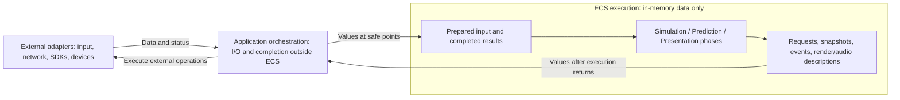

# MVP Flecs world phases

Status: phase breakdown accepted by the owner, with no I/O inside the ECS. Detailed scheduling integration remains proposed and unimplemented. The owner named the server's **Simulation World** and requires separate client **Prediction World** and **Presentation World**, interchangeable human/agent input, GPU static-only prediction, and server-owned dynamic state. The owner also fixed simulation/prediction at 240 Hz with fixed steps and presentation at a 60 Hz target with variable steps. These requirements and the phase order below are accepted; they have not been implemented. See [C4](c4.md), [the stack](technology-stack.md), and [ADR-0002](adr/0002-separate-client-worlds-and-input.md).

The [phase contract proposal](phase-contracts.md) defines logical input/output types, permitted state changes, data ownership, and external physics request/result exchange for all 17 phases. These type contracts remain proposed; the phase order and constraints above remain accepted.

## No I/O inside the ECS

This is a mandatory rule for **all three worlds**, including systems, observers, hooks, and any helpers they call. ECS execution only reads and transforms in-memory values. Network, files/assets, console/log output, device polling, agent invocation, audio playback, rendering, GPU submission/readback, and external waits execute in application-owned adapters outside ECS execution. Time and external errors/status are supplied as values; diagnostics leave through an in-memory outbox. An asynchronous or non-blocking I/O call is still I/O and is not allowed inside the ECS.

Phase names denote world-level data transformations, not external operations. `ImportCommands` and `ImportAuthority` import already available memory; `BuildCommands` consumes prepared input; `ExportCommands` and `ExportPresentation` export descriptions; `ComposeFeedback` prepares feedback state. They do not call GameNetworkingSockets, input providers, Steam Audio, Falcor, or an operating-system device interface.

The same rule applies to physics: ECS stages prepare PhysX requests and import completed results. Application orchestration invokes CPU/GPU PhysX and waits for completion **between ECS execution segments**, including during reconciliation. It must not hide an SDK/device call inside a world method, system callback, observer, or injected function. See [ADR-0004](adr/0004-keep-io-outside-ecs.md).

## One abstraction level for every phase

All phases describe a **world processing stage with explicit in-memory input, state changes, and output**. The sequence is import, interpretation/composition, state advancement, and export. Names identify what happens to world data; they do not identify a library, thread, transport operation, device call, entity loop, or GPU fence. This does not require equal amounts of code or equal runtime per phase.

The owner approved the functional ordering and subsequently required no ECS I/O and a consistent abstraction level. The names below refine that same ordering: for example, `SendCommands` becomes `ExportCommands`, `DispatchAudio` becomes `ComposeFeedback`, and `RenderFrame` becomes `ExportPresentation`. SDK request preparation, result import, command validation, physics queries, and event deduplication are systems or orchestration details within/between these stages, not additional peer phases. Concrete execution segments must preserve this distinction.

| World | Import | Interpret or compose | Advance or resolve | Export |
| --- | --- | --- | --- | --- |
| Simulation | `ImportCommands` | `UpdateParticipants`, `ResolveIntentions` | `AdvanceSimulation`, `ResolveInteractions` | `ExportState` |
| Prediction | `ImportAuthority` | `ReconcileState`, `BuildCommands` | `AdvancePrediction` | `ExportCommands`, `ExportState` |
| Presentation | `ImportState` | `ComposeScene`, `ComposeView`, `ComposeFeedback` | No simulation advancement | `ExportPresentation` |

## Scheduling model

Use one logical ordered pipeline per world, with project-defined phases. The application may execute explicit segments around external physics operations; a logical phase can have request preparation and result import stages. A phase groups systems with a shared ordering purpose; it does not allocate a thread. Use explicit phase dependencies rather than registration order. Start with one writer per world and no concurrent progression of the same world. This proposal does not add oneTBB.

The owner requires the following rates, recorded in [ADR-0003](adr/0003-world-update-rates.md):

| World | Required cadence | Time passed to its systems |
| --- | --- | --- |
| Simulation World | 240 Hz | Fixed `1 / 240` seconds, approximately 4.167 ms. |
| Prediction World | 240 Hz | The same fixed `1 / 240` seconds, including each replay step. |
| Presentation World | 60 Hz target, paced by the application | Variable monotonic elapsed time between presentation updates; approximately 16.667 ms under steady pacing. |

Each process owns its clock and accumulator; equal frequency does not imply aligned clocks or tick identifiers. Normally about four prediction ticks finish between presentation frames, but this is not a fixed four-iterations-per-frame loop. A delayed frame must not enlarge the physics timestep. Presentation reads the latest completed output and continues consuming confirmed events independently of whether a fresh prediction output arrived.

Proposed execution: the Windows main thread pumps window events and runs presentation; a separate prediction thread owns the Prediction World and its 240 Hz loop. The server owns a separate 240 Hz simulation loop. Immutable inboxes/outboxes connect these owners. Rendering, frame pacing, audio callbacks, and slow agent decisions must not block prediction. Flecs phase dependencies order work within one world and do not synchronize these threads.

A fixed step is not a hard real-time guarantee. Budget each normal simulation/prediction tick against the 4.167 ms period, including PhysX completion, and measure overruns and replay separately. Bound catch-up and replay; report overload instead of silently increasing the fixed step or accumulating unlimited work. The numerical limits and recovery policy remain open. Network send cadence is separate from tick frequency: publication phases produce tick-labelled output, while transport may batch commands and coalesce replaceable snapshots without losing discrete events.

The application performs all I/O outside ECS execution, including network transport and window events. Phases drain bounded in-memory inboxes and enqueue output; they do not wait for a packet, human input, or an agent decision. Real-time connection deadlines and focus handling remain independent of simulation catch-up and frame rate. Startup first verifies and loads the [signed cooked pack](cooker-and-packs.md), then creates geometry and SDK resources from prepared data before normal progression; shutdown stops input and transport and releases resources after outstanding work completes.

## Simulation World: fixed server tick

| Order | Custom phase | Responsibility and completed output |
| --- | --- | --- |
| 1 | `ImportCommands` | Drain validated transport envelopes and peer changes into the tick inbox. Establish one arrival cutoff so late packets belong to a later tick. No world mutation from network callbacks. |
| 2 | `UpdateParticipants` | Apply joins, departures, and expired-peer notifications; select free spawn locations and enforce four slots. Update ECS membership and export physics lifecycle requests. External orchestration completes corresponding PhysX changes before movement/query requests use these players. |
| 3 | `ResolveIntentions` | Validate participant identity, command sequence, and allowed movement/look/fire values. Select bounded movement input for this tick; consume each discrete action once. Untrusted client timing cannot buy extra simulation steps. |
| 4 | `AdvanceSimulation` | Prepare CPU physics requests for static and dynamic collision response, including player blocking; after external execution, import completed accepted poses before continuing. No PhysX call runs inside the ECS. |
| 5 | `ResolveInteractions` | Prepare shot queries for the completed authoritative scene; import externally computed query results, select the closest blocking hit, and create confirmed events addressed only to the shooter and target. |
| 6 | `ExportState` | Export an immutable authoritative snapshot with server tick, player lifecycle/state, and each client's resolved input prefix. Enqueue recipient-specific events and state for transport. |

Proposed shot timing is the scene after movement in the processing tick, using validated command view direction and authoritative shooter position. It does not add historical rewind. Mark inputs resolved only when the snapshot reflects their disposition, including rejection. More command packets must not increase movement speed or duplicate a shot. Exact sequence-gap handling and input-age thresholds belong to the protocol design.

## Prediction World: fixed client tick

| Order | Custom phase | Responsibility and completed output |
| --- | --- | --- |
| 1 | `ImportAuthority` | Drain new authoritative snapshots and lifecycle changes from the application inbox. Reject older state; retain server-supplied dynamic samples as read-only observation data, not predicted collision bodies. Confirmed feedback has a separate presentation event queue. |
| 2 | `ReconcileState` | Rebuild provisional state from the authoritative baseline and unresolved movement history, using externally supplied physics results. Finish correction before creating the next command. |
| 3 | `BuildCommands` | Consume already prepared movement/look/fire values from exactly one human or agent source, assign sequence and tick identity, and retain the command for prediction and transmission. Both sources use the same validation and command representation. |
| 4 | `AdvancePrediction` | Prepare local static-only movement requests; import completed results after the external GPU PhysX adapter runs and expose a coherent predicted pose; do not simulate other players, dynamic collision response, or confirmed hits. |
| 5 | `ExportCommands` | Append newly created command values to an in-memory outbox; an external network adapter calls GameNetworkingSockets. Transport retransmission preserves command identity; reconciliation does not generate another send. |
| 6 | `ExportState` | Publish immutable previous/current local poses, their prediction tick, and the server baseline used. Presentation can identify resets/corrections and combine this output with separately received dynamic snapshots. |

Human device events are captured independently of tick frequency. Movement state may be sampled each tick, while mouse deltas and click edges are consumed once; catch-up ticks must not repeat the same click or rotation delta. Focus loss clears human input and communicates neutral movement. The external agent adapter consumes a published immutable client observation and returns prepared input carrying that observation identity. `BuildCommands` consumes available results after reconciliation with the same explicit stop semantics; asynchronous decisions must carry their observation identity and must not block the pipeline. Agent policy and observation schema remain open.

Reconciliation uses the same request/result movement operation as `AdvancePrediction`, with historical commands and the fixed step. The application drives each external PhysX replay operation between ECS preparation/import segments. It does **not** recursively progress this Flecs world or rerun `BuildCommands`, `ExportCommands`, feedback, or presentation. Restore every movement-relevant state item required by the chosen physics technique, not only position. Bounded history/replay limits and fallback to a fresh server baseline remain to be specified. A stale snapshot or duplicate acknowledgement must not cause a second correction or repeat an effect.

GPU prediction is still a feasibility requirement: the selected character movement technique must demonstrate actual GPU execution and the agreed capsule/wall behavior. CPU controller queries inside a GPU-enabled scene do not establish this. See [the integration constraint](technology-stack.md#integration-proposals).

## Presentation World: rendered frame

| Order | Custom phase | Responsibility and completed output |
| --- | --- | --- |
| 1 | `ImportState` | Import immutable prediction output, server dynamic snapshots/lifecycle, and confirmed events. Update presentation entities and identity mapping; late state must not resurrect a departed player. |
| 2 | `ComposeScene` | Choose the local predicted pose and interpolate server-supplied remote poses. Apply correction smoothing only to presentation; do not extrapolate dynamic simulation or feed transforms back into prediction. |
| 3 | `ComposeView` | Derive first-person camera, visible capsule/facing transforms, fixed scene geometry, and centered marker from the composed state. Produce camera and viewpoint data in the Presentation World. |
| 4 | `ComposeFeedback` | Transform deduplicated confirmed recipient events into pending non-spatial feedback data. This phase prepares world data; it neither publishes to an audio device nor invokes the audio adapter. |
| 5 | `ExportPresentation` | Export immutable scene/view descriptions and pending feedback events to memory outboxes. External graphics and audio adapters consume them after ECS execution. Preserve individual event identity when coalescing replaceable frame data. |

All clients keep rendering when unfocused. Human and agent clients use these same phases. The application consumes audio output independently of physics replay and before potentially blocking graphics presentation; queuing a signal does not count as measured audible output. The audio output backend and Falcor exception adapter remain separate unresolved proposals.

## Transfers and completion rules

Each transfer between worlds represents project-owned value data through an application-controlled inbox, not an ECS entity handle, pointer, or a cross-world Flecs dependency. Tick/baseline metadata distinguishes fresh dynamic state from an older prediction output. Player lifecycle must take precedence over stale transform samples. Replaceable snapshots and confirmed event queues have different retention rules; dropping an old snapshot must not drop a hit event.

Phase order alone does not flush deferred structural mutations or wait for an SDK. In this design, session/import phases must make created/removed entities visible before dependent queries run. System declarations must expose reads and deferred writes so Flecs can place needed merge points; verify these points with actual entity lifecycle checks. Keep intra-phase systems independent, or combine an ordered operation behind one module interface. Do not rely on incidental system registration order.

The application owns physics submission, completion, and result transfer between explicit ECS segments. `AdvanceSimulation`, `AdvancePrediction`, `ResolveInteractions`, and `ReconcileState` retain their logical order, but ECS request preparation must return before the external operation runs; result import precedes dependent ECS work. Use explicit phase/stage selection rather than recursively progressing a world or assuming a single `progress()` call can suspend itself for external I/O. The concrete segmentation must be validated during implementation. PhysX/CUDA completion happens outside ECS before results are imported; Flecs merge points do not provide GPU fences.

Flecs mechanisms verified against the [v4.1.6 systems documentation](https://github.com/SanderMertens/flecs/blob/v4.1.6/docs/Systems.md): custom phase entities use the phase tag and `DependsOn` ordering; pipelines select and order systems. Built-in phases such as `OnLoad`, `OnUpdate`, and `OnStore` are available, but the phase names above are Blackflower definitions. The phase chain can use the standard phase-aware pipeline; a bespoke scheduler is not required. Deferred-write annotations inform automatic synchronization, while external SDK completion remains application-owned.

## Validation and unresolved detail

Review phase additions against the abstraction rule: each must name a world data transformation with a clear input/output contract. Keep SDK calls, fences, codecs, device actions, and per-entity loops below that level.

Before implementation, refine affected ticket criteria for command equivalence, lifecycle visibility, stale snapshot rejection, correction/replay, and presentation isolation. Proposed observable checks include:

- World-level checks consume prepared input/physics results and expose memory output without opening files/sockets, polling devices, invoking agents, writing logs, or submitting GPU/audio/render work. Verify module dependencies and transitive calls as well as observable effects; a mock alone does not prove absence of I/O.
- Real adapter integration checks separately establish SDK execution, transport, rendering, audio, and completion ordering.
- A join or departure changes collision/query membership and the exported snapshot in the same completed server tick.
- Duplicated commands and replay produce one server action and at most one audible event per intended recipient.
- A server correction changes local prediction before the next new command; replay never polls the input source or resends a shot.
- Fixed-step traces show `1 / 240` seconds per simulation/prediction step, including replay, while presentation uses measured elapsed time and targets 60 Hz.
- Multiple catch-up ticks preserve one click as one action; zero prediction ticks still allow dynamic presentation and confirmed feedback to advance.
- Player contact is resolved by the Simulation World; the client only corrects from server output and never predicts that dynamic collision response.
- Changing render rate or presentation smoothing does not change simulation input or authoritative results for an identical timed command trace.

The world rates are decided; snapshot send frequency, bounded catch-up/replay limits, input-age policy, correction tolerances, and exact wire representation remain open. These details must fit the existing five-minute, four-client frame-time and response criteria. No systems have been implemented or runtime-tested by this documentation change.
