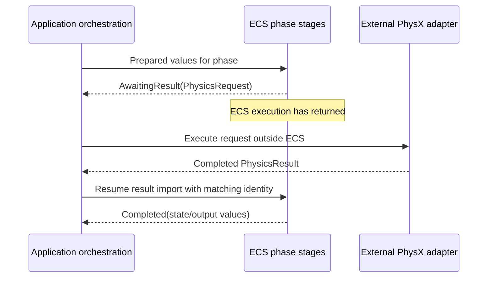

# MVP world phase contracts

Status: proposal for review, not implemented or added to the published tickets. The [phase order](flecs-phases.md), world names, update rates, static-only GPU prediction, and [absence of I/O inside ECS](adr/0004-keep-io-outside-ecs.md) are already agreed. This document proposes logical value types and state permissions; it does not prescribe C++ layouts, Flecs components, SDK types, or a wire format.

Startup content is supplied by the [verified cooked-pack loader](runtime-lifecycle.md#content-preparation-boundary), outside ECS. Resource identities and scene definitions below refer to that prepared content; no phase imports or cooks source assets.

## Contract conventions

Each phase reads explicit input values plus the permitted resident world state, changes only the listed state, and produces value output. A table entry is a logical data contract, not a requirement to copy the whole world or create a separate class for every row. Inputs may be borrowed read-only for one invocation; anything retained or exported must have owned, stable storage. No mutable data or ECS/SDK handle is shared across worlds or threads.

All phases can emit `Diagnostic` values. Diagnostics contain a category, associated identity/tick, and relevant values; external code handles formatting and logging. Time is supplied by application orchestration. Phases cannot obtain it from a clock or invoke an input provider, device, SDK, network, or file operation.

For phases needing external physics, distinguish three logical outcomes:

- `Completed`: the phase's output is ready and dependent phases may run.
- `AwaitingResult`: a value request has been produced and ECS execution returns to the application. This is not a blocking wait or a future executing inside ECS.
- `Failed`: an explicit failure value is returned. The dependent state is not advertised as complete; application policy handles recovery or shutdown.

The application executes the request outside ECS and resumes the phase's result-import stage with matching result values. It does not rerun earlier stages or recursively progress the world. Prepare/import stages remain below the agreed phase abstraction. Structural changes may be staged while awaiting a result; no external snapshot or dependent query may observe the phase as completed before its required results are incorporated.

## Shared value vocabulary

| Proposed type | Minimum logical content and rules |
| --- | --- |
| `PackId` | Identity of the authenticated cooked-content manifest/header as proposed in [the pack design](cooker-and-packs.md). Supplied by external verification; ECS performs no hashing, signature verification, or file access. |
| `ScenarioBuildId` | Common identity of the scenario cooking build, authenticated in both role-specific packs; proposed admission compatibility key. Distinct from each artifact's `PackId` and from geometry-only `SceneRevision`. |
| `SessionId`, `ParticipantId`, `ConnectionId` | Distinct project identities. A reconnect creates a new participant incarnation; delayed data from the previous connection cannot address its replacement. Session identity separates server runs. |
| `SimulationTick`, `PredictionTick`, `PresentationFrame` | Distinct monotonic counters in their own domains. Equal numerical values do not establish a shared time or baseline. |
| `SimulationStep`, `PredictionStep` | Respective tick, session, and fixed duration `1/240 s`. Prediction also identifies the current correction revision. |
| `PresentationStep` | Frame identity, application-supplied monotonic sample time, and measured elapsed duration. Target 60 Hz; elapsed duration remains variable. |
| `SceneDefinition` | Supplied by the external verified-pack loader: immutable scene revision, fixed geometry, spawn positions, and capsule dimensions. Physics and rendering consume the same definitions. Coordinate convention remains to be chosen; positions/distances use metres. |
| `MovementState` | Position, orientation, linear velocity, and all additional movement state needed by the chosen controller for restoration. Required controller-specific values remain to be proven, rather than assuming position alone is enough. |
| `InputIntent` | Prepared movement axes, absolute desired look orientation, independently identified fire edges, source sample identity, and local sample time. Human and agent adapters produce the same fields; source kind does not alter simulation rules. |
| `ParticipantCommand` | Session/participant identity, command sequence, originating prediction tick, normalized movement/look values, and fire action identities. Client data is untrusted on the server. Each command represents at most one fixed movement step; receipt of extra commands cannot grant extra steps. |
| `PeerChange` | Connection identity and join, leave, or expiry status supplied by the application. It describes an already observed event and performs no transport operation. |
| `InputResolution` | Participant identity and highest contiguously resolved command sequence, with the authoritative snapshot tick that includes its effects or rejection. Resolving is distinct from packet receipt. |
| `AuthoritativeSnapshot` | Session, scene revision, simulation tick, complete current participant roster and movement state, and recipient input resolution. A full snapshot is proposed for at most four participants; transport encoding is a separate decision. |
| `ConfirmedEvent` | Session-unique event identity, simulation tick, originating action identity, hit participants, and intended recipients. Only server-confirmed events can produce the MVP hit signal. |
| `PredictionSnapshot` | Session, scene revision, local participant, previous/current predicted movement, prediction ticks, source authoritative tick/input resolution, and correction revision. Reset/correction markers prevent interpolation across incompatible histories. |
| `ClientObservation` | Immutable client-visible local prediction plus server-supplied remote samples, with their separate tick/baseline identities. An external agent may consume it; it grants no private server data. Detailed perception policy remains open. |
| `PhysicsRequest` / `PhysicsResult` | Project-owned tagged data described below. Correlated by session, world role, request identity, tick, correction revision where applicable, and scene revision. Results contain data/status, never a PhysX or CUDA handle. |
| `OutputBatchId` / `OutputReceipt` | Identity of a value batch and application acceptance into a memory outbox. This receipt does not assert network delivery, audible playback, or frame presentation. |

`InputIntent` uses absolute orientation so repeated sampling of the same input cannot apply a mouse delta repeatedly. Device adapters accumulate raw mouse deltas and capture click edges externally. `BuildCommands` consumes each sample's fire edges once. Missing/stale input cannot synthesize a click. Movement hold duration, expiry thresholds, and bounded command-gap policy remain open; focus loss or explicit agent stop overrides any retained movement with neutral input.

## Simulation World contracts

Every row also receives `SimulationStep` and read-only scene/rule configuration from verified runtime content when applicable. Admission compares the peer scenario build identity supplied as data with the configured `ScenarioBuildId` before participant creation. Proposed resident state groups are participant membership, accepted movement, command resolution/history, pending interactions, and the event/output ledger.

| Phase | Input values | Permitted state changes | Output values |
| --- | --- | --- | --- |
| `ImportCommands` | `ServerIngress`: decoded command envelopes, connection identities, `PeerChange` values, and arrival cutoff metadata | Replace the current tick inbox; no accepted movement or membership changes | `TickInbox`: bounded ordered commands and peer changes for this tick |
| `UpdateParticipants` | `TickInbox.peerChanges`, current roster, `SceneDefinition`, matching physics lifecycle/spawn-query results when needed | Stage and commit participant membership, spawn state, and removal of participant-owned history | `ParticipantChanges`, `AdmissionDecisions`; if necessary, `PhysicsRequest` for spawn queries and scene membership, consumed through matching `PhysicsResult` |
| `ResolveIntentions` | `TickInbox.commands`, completed `ParticipantChanges`, current roster and command ledger | Resolve legal movement/look intentions; track accepted/rejected command disposition and consume fire edges once | `MovementIntentBatch`, `InteractionIntentBatch`, candidate command resolutions |
| `AdvanceSimulation` | Accepted movement state, `MovementIntentBatch`, scene revision; matching physics result on resumption | Commit new authoritative movement only after completed physics | `PhysicsRequest` for movement with static and dynamic collision; then `SimulationState` for the completed tick |
| `ResolveInteractions` | `InteractionIntentBatch`, completed `SimulationState`; matching shot-query result on resumption | Resolve pending shots and append confirmed events; finalize command disposition for this tick | `PhysicsRequest` for shot queries; then `ConfirmedEventBatch` and completed `InputResolution` values |
| `ExportState` | Completed roster/movement/resolutions, pending confirmed events, memory `OutputReceipt` values | Update export bookkeeping only | `ServerOutput`: recipient snapshot batches, event batches, and pending admission responses |

`ServerIngress` contains already decoded data, not trusted gameplay decisions. `ResolveIntentions` still checks connection-to-participant binding, finite/ranged values, sequence validity, movement limits, and duplicate actions. Commands received after the tick cutoff remain for a later tick. Empty inboxes are valid; expired movement follows the agreed input-age policy once specified.

The full snapshot roster is authoritative: when a newer valid snapshot omits a former participant, clients remove it. Connection changes and membership generation prevent delayed samples from resurrecting a departed participant. Admission responses are only marked successful after spawn/membership setup completes; the external network adapter transmits them.

Shot queries use the completed processing-tick scene and authoritative shooter position, with validated command look direction. A query result includes enough ordered hit information to select the nearest blocking surface and distinguish environment from participant hits. Rejected actions generate no hit feedback. Historical rewind remains outside this proposal.

## Prediction World contracts

Every row receives `PredictionStep`. Resident state groups are the latest accepted authority, provisional local movement, command/replay history, consumed input samples, and export bookkeeping. Remote state is received observation data; it never enters local predicted collision response.

| Phase | Input values | Permitted state changes | Output values |
| --- | --- | --- | --- |
| `ImportAuthority` | `AuthorityInbox`: decoded snapshots, admission/lifecycle status, and connection/session status | Accept newer compatible authority and remote samples; invalidate data from obsolete sessions | `AuthorityUpdate`: newest usable baseline, input resolution, roster change, or explicit no-update/reset status |
| `ReconcileState` | `AuthorityUpdate`, local command history and movement state; matching restore/replay results on resumption | Restore authoritative baseline, discard resolved movement history, rebuild provisional state, and advance correction revision | Zero or more correlated `PhysicsRequest` values for restore/replay; then `ReconciledState` and `ClientObservation` |
| `BuildCommands` | Prepared `InputIntent` values, reconciled state, admission status, and input-age/stop status supplied as data | Consume new input samples/fire edges, allocate command sequence, retain new command in history | `CommandBatch` and `LocalMovementIntent`; same command values are later exported for networking |
| `AdvancePrediction` | `ReconciledState`, `LocalMovementIntent`, scene revision; matching movement result on resumption | Commit the completed provisional local movement | `PhysicsRequest` for local movement against static geometry only; then `PredictedState` |
| `ExportCommands` | New retained `CommandBatch`, admission status, memory `OutputReceipt` values | Update command-outbox bookkeeping only; retain unresolved movement for reconciliation | `ClientCommandOutput`: identified commands in an in-memory batch |
| `ExportState` | Completed `PredictedState`, authoritative baseline metadata, server remote samples, and correction revision | Update immutable snapshot history/export bookkeeping only | `PredictionSnapshot` and current `ClientObservation` |

No authority update means reconciliation can complete without a restore. Before admission and a valid baseline, local movement prediction and gameplay command export remain inactive. Late or mismatched physics results cannot overwrite a newer correction revision. Replaying movement preserves the original command identities, does not invoke an input source, and produces no command export or confirmed event.

The external agent reads an exported observation and returns a prepared intent tagged with its source observation. `BuildCommands` never waits for an agent or assumes a decision for the current tick is available. Human focus loss and agent stop arrive as prepared input/status values; their effect is neutral movement and no new fire edges. A concrete policy for missing/stale continuous input remains to be agreed.

Presentation receives confirmed server events through its own application inbox. An event is not embedded solely in a replaceable `PredictionSnapshot`, so slower rendering or a skipped prediction export cannot silently discard it.

## Presentation World contracts

Every row receives `PresentationStep`. Resident state groups are the imported sample history, visible participant membership, composed transforms/view, pending feedback, and output acceptance bookkeeping.

| Phase | Input values | Permitted state changes | Output values |
| --- | --- | --- | --- |
| `ImportState` | `PresentationInbox`: prediction snapshots, full authoritative snapshots, confirmed events, lifecycle/status, and memory output receipts | Update compatible sample history and visible membership; collect unconsumed events and accepted-output status | `PresentationSamples` and `PendingEvents` for this frame |
| `ComposeScene` | `PresentationSamples`, `SceneDefinition`, interpolation/correction policy | Update presentation-only transforms and smoothing history | `ComposedScene`: project entity/geometry identities, visible transforms, and source-sample metadata |
| `ComposeView` | `ComposedScene`, local participant orientation, viewport/configuration values | Update presentation camera/view state | `ComposedView`: camera pose/projection, viewport, and centered marker description |
| `ComposeFeedback` | `PendingEvents`, local recipient identity, existing pending/export ledger | Deduplicate confirmed events and prepare pending feedback without marking it played | `FeedbackBatch`: event identity, participant recipients, and non-spatial signal identity |
| `ExportPresentation` | `ComposedScene`, `ComposedView`, pending `FeedbackBatch`, memory output receipts | Update output bookkeeping only | `RenderDescription` and a separate `AudioDescriptionBatch`, each with output identity |

`RenderDescription` contains project-owned geometry/material identities, transforms, camera/view data, and frame metadata. The external Falcor adapter maps these to resources and renders. `AudioDescriptionBatch` contains confirmed event/signal identities and the agreed non-spatial playback parameters; the external audio adapter maps them to buffers and device operations. Neither output contains device or SDK handles.

Remote interpolation uses only server samples and never writes into prediction or authority. If a future sample is absent, hold the latest available remote pose rather than introducing dynamic extrapolation. A correction/session discontinuity resets incompatible smoothing history. The choice of interpolation delay and acceptable correction smoothing remains open.

Render descriptions can be superseded by newer frames. Audio events cannot be discarded by the same coalescing rule: retain them until accepted into the application's memory outbox, preserving event identity across retries. Acceptance is not playback; the external adapter deduplicates repeated event identities and reports actual failures. No exactly-once guarantee across process crashes is introduced by this MVP.

## Physics request/result exchange

These are data variants of the same logical request/result contract, not new peer phases or SDK calls:

| Operation | Request data | Completed result data |
| --- | --- | --- |
| Spawn and membership | Candidate spawn geometry or admitted/removed participant identities and initial states | Occupancy query results or scene membership completion/failure |
| Advance movement | Fixed step, current movement/baseline identity, movement intentions, and collision scope: authoritative static/dynamic or predicted static-only | Resulting movement states and required collision facts, or explicit failure |
| Query shots | Completed simulation tick/scene revision, action identities, authoritative ray origins/directions, and query limits | Correlated ordered blocking-hit candidates or no-hit results |
| Restore prediction | Authoritative local movement baseline and correction revision | Restored movement completion/failure before replay advances the same physics instance |

All operations carry a unique request identity and the relevant session/tick/scene/correction metadata. Wrong, duplicate, or obsolete results are rejected or ignored without advancing the phase twice. A missing result leaves the operation incomplete; only external orchestration waits or applies a timeout policy. SDK internal state stays in the adapter; any state needed for correct authoritative restore must have a defined project-level representation or rebuild procedure. The exact restoration data is a feasibility item, not a claim of CPU/GPU determinism.

## Validation and decisions remaining

Check each of the 17 phase contracts for permitted writes, producer/consumer consistency, stable ownership, empty input, duplicate input, session changes, stale results, and failure propagation. Contract tests operate on values and inspect both resulting state and emitted requests; real adapter integration tests establish physical behavior and output. A new schema cannot be validated by checking field names alone.

Proposed concrete checks include: duplicate fire edges yield one action; export retry preserves identities; a mismatched physics result changes no accepted state; a full roster update removes a departed player despite stale presentation data; a late restore cannot overwrite a newer correction; and a newer render frame cannot consume or delete pending audio events.

Before C++ type design, settle coordinate conventions, controller restoration fields, command-gap/input-age rules, capacities/replay limits, interpolation timing, adapter failure policy, and the agent observation schema. Serialization precision and wire encoding follow after logical contracts are agreed. The phase-level input/output design does not change the accepted 240/240/60 Hz cadences or introduce I/O inside the ECS.
