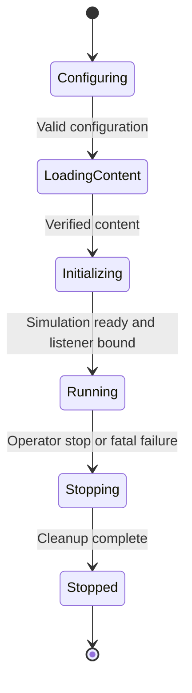
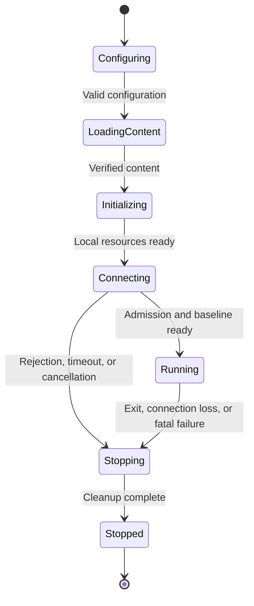

# MVP client and server lifecycle

Implemented subset: [#21](https://github.com/sergioffpc/blackflower/issues/21)
supplies the
[uv-managed OpenUSD cooker, signed primitive packs and C++ content loader](content-pipeline.md).
The rest of the runtime/SDK design below remains proposed. The cooker produces
`.bfserver`, `.bfagent` and `.bfclient` files. Applications select paths; the
loader validates resource schemas without a role parameter.

Status: proposal for review, not implemented. The two runtime roles, world
separation, update rates, cooked signed content, and absence of I/O inside ECS
are already required. This document proposes application states, readiness
gates, and cleanup behavior around the agreed [world phases](flecs-phases.md)
and [phase contracts](phase-contracts.md). The published MVP requires
five-second connection and communication-loss limits; the admission timing
boundary below is a proposed clarification.

## Application ownership and states

The application owns the process lifecycle, clocks, configuration, content
loader, external adapters, and world scheduling. Each world owns its in-memory
state. Lifecycle states describe application readiness; they are not Flecs
phases, additional worlds, or components that perform I/O.

Both runtimes use `Configuring`, `LoadingContent`, `Initializing`, `Running`,
`Stopping`, and terminal `Stopped` states. The client also uses `Connecting`.
`Stopped` carries a success or failure outcome and a reason; failure follows the
same cleanup path as an ordinary stop. An error or stop request in any
nonterminal state transitions to `Stopping`. Cleanup handles partially
initialized resources and repeated stop requests.

| State                 | Input                                                                 | Completion output and transition gate                                                                                    |
| --------------------- | --------------------------------------------------------------------- | ------------------------------------------------------------------------------------------------------------------------ |
| `Configuring`         | Process arguments and supported deployment settings                   | Validated runtime configuration, including pack location and network endpoint; otherwise stop with an error.             |
| `LoadingContent`      | Configuration, artifact bytes, independent trust set                  | Verified immutable content; otherwise stop before world creation.                                                        |
| `Initializing`        | Verified content and runtime configuration                            | Required adapters/resources and initialized world state; no gameplay can start while required preparation is incomplete. |
| `Connecting` (client) | Prepared client and configured server endpoint                        | Accepted admission and a usable authoritative baseline, or failure within the connection deadline.                       |
| `Running`             | Prepared runtime, external input/status and completed adapter results | Completed world updates and output requests, until an explicit stop or fatal failure.                                    |
| `Stopping`            | Stop reason and resources actually acquired                           | Scheduling and external work quiesced, resources released, final process outcome.                                        |
| `Stopped`             | Final outcome                                                         | Process exit; no automatic restart or reconnection in the MVP.                                                           |

## Server lifecycle

The diagram shows the successful startup path; the common error/stop transition
applies to every active state.

1.  Validate configuration, then verify and load the ServerScene file before
    opening the admission listener.
2.  Prepare CPU PhysX and the static scene through external adapters. Initialize
    an empty Simulation World from validated scene/rule values. Create a fresh
    `SessionId`; no participant exists yet. The server needs no graphics or
    audio resources.
3.  Bind the listener only after the simulation is ready. A bind failure stops
    the application and cleans up the prepared runtime. Enter `Running` with
    zero participants; there is no minimum-player wait.
4.  Run Simulation at fixed `1/240 s` steps. External orchestration services
    transport and clocks, imports prepared values, executes ECS segments,
    carries out requested physics operations, and sends completed outputs. A
    phase awaiting physics results has not completed its tick.
5.  Continue running when players join or leave, including after the last player
    leaves. Propose `SIGINT` and `SIGTERM` as operator stop requests handled by
    application orchestration, without cleanup or ECS work inside the signal
    handler.

### Participant admission and departure

Transport connection and gameplay admission are distinct. A connected peer is
not yet a participant.

| Peer state | Gate and effect                                                                                                                                                                                                                                        |
| ---------- | ------------------------------------------------------------------------------------------------------------------------------------------------------------------------------------------------------------------------------------------------------ |
| Pending    | The external transport supplies connection status and decoded admission data. Compare the client's verified `ScenarioBuildId` with the server's configured scenario build identity before participant creation. No gameplay commands are accepted yet. |
| Admitting  | `UpdateParticipants` checks capacity and stages a free predefined spawn. Count pending spawn reservations toward the four-slot limit. Complete any requested physics membership/spawn work externally before committing membership.                    |
| Active     | Export admission success only after participant creation succeeds, together with the initial authoritative baseline. The participant can interact immediately without waiting for others.                                                              |
| Removing   | Explicit disconnect or communication expiry becomes a prepared `PeerChange`. Remove participant state, histories, and physics membership; release the slot and spawn reservation once removal completes. Remaining participants continue.              |
| Closed     | Discard old connection data and late results. A later connection gets a new participant identity and a new free predefined spawn.                                                                                                                      |

Reject a fifth admission with `server full`; reject a different scenario build
with a content-mismatch reason. The external adapter transmits rejection and
closes the connection. A failed or abandoned admission releases its reservation
through the same removal path. Propose a separate five-second server-side
pending-admission deadline, measured from transport acceptance, so an incomplete
handshake cannot retain resources indefinitely. Exact protocol encoding and
pending-connection limits remain open.

## Client lifecycle

The common error/stop transition also applies during configuration, loading, and
initialization.

1.  Validate server IP/port and local configuration, then verify and load the
    ClientScene file.
2.  Prepare window, Vulkan-only rendering, cooked SPIR-V shader resources, GPU
    PhysX static geometry, audio, input source, and transport through external
    adapters. Initialize Prediction and Presentation Worlds from verified
    values, without a local admitted participant. Failure of a required
    subsystem prevents connection; GPU prediction has no silent CPU fallback.
    Vulkan is the only graphics backend: missing required Vulkan capabilities
    stop startup, with no DirectX 12 fallback.
3.  Begin the connection attempt only after local preparation succeeds. Exchange
    admission data and await a valid baseline containing the assigned
    participant, session, compatible scene, and initial authoritative movement
    state. Keep event processing and cancellation responsive; buffer no
    pre-admission movement or fire actions for later replay.
4.  Import that baseline and complete any external physics restoration needed to
    make it usable before enabling gameplay. Enter `Running`; Prediction
    advances at fixed `1/240 s` steps, and Presentation targets 60 Hz with
    measured variable elapsed time. Their schedules are independent; there is no
    hardcoded four-prediction-ticks-per-frame rule.
5.  Human and autonomous clients follow this same lifecycle and command path.
    Only the input adapter changes. An agent receives client-visible
    observations after admission; its execution never blocks an ECS phase.

Window/event processing during preparation and connection belongs to the
application. Once Presentation resources are ready, it may render prepared
scene/status data before admission, without inventing a local player or gameplay
camera. This does not enable Prediction movement or command export.

### Focus, deadlines, and exit

| Event                         | Required behavior or explicit proposal                                                                                                                                                                                                                                                                                                            |
| ----------------------------- | ------------------------------------------------------------------------------------------------------------------------------------------------------------------------------------------------------------------------------------------------------------------------------------------------------------------------------------------------- |
| Human window loses focus      | Release mouse capture and submit neutral movement/no fire. Stop accepting human gameplay input while transport, reconciliation, prediction scheduling, and presentation continue. Focus is an input condition, not an application pause.                                                                                                          |
| Human window regains focus    | Resume fresh input under the existing capture policy; do not replay clicks or deltas accumulated while unfocused.                                                                                                                                                                                                                                 |
| Agent control stops           | Submit neutral input through the same pipeline. Window focus does not control the agent. Stopping control alone does not terminate the process; process exit is a separate request.                                                                                                                                                               |
| Initial connection            | The accepted limit is five seconds. Propose one monotonic deadline from the first connection attempt through admission and usable-baseline preparation; do not restart it for each handshake stage. Local pack/resource preparation occurs before this deadline.                                                                                  |
| Communication loss            | After five seconds without communication on an established connection, the application reports loss. The server removes the participant; the client stops with a console error and failure outcome. Propose measuring from the last valid peer communication, including transport liveness traffic, rather than the last gameplay snapshot alone. |
| Explicit rejection/disconnect | Act immediately on the known failure; do not wait for a silence timeout. The client reports the reason, cleans up, and exits. Restart is manual.                                                                                                                                                                                                  |
| User exit                     | Esc stops the client. Propose treating window close identically. Send a best-effort disconnect notification during cleanup; remote acknowledgement is not required for local exit.                                                                                                                                                                |

Clocks and timeout decisions are external to ECS. Import expiry/focus/stop
status as values. Delivery of neutral input needs the bounded input-age policy
already identified in the phase contracts; a lost update must not leave
authoritative movement active indefinitely. That threshold is still unresolved
and is distinct from the five-second connection-loss deadline.

## Content preparation boundary

The [cooker and pack design](cooker-and-packs.md) owns offline import,
optimization, conversion, packaging, and signing. Runtime consumption belongs
here.

The external loader performs this sequence before publishing any content or
creating worlds:

1.  Read the artifact and validate fixed-header syntax, file size, ranges,
    overflow, manifest structure, duplicate identities, and supported format.
    Avoid unchecked allocations and traversal/extraction of asset paths.
2.  Resolve the signing-key identifier against the independently provisioned
    runtime trust set and verify the signature over the exact authenticated
    header/manifest transcript.
3.  Validate all declared payload digests, layout/padding, resource schemas,
    references and scene encoding. Consumers select the resources they need;
    deployment platform and consumer purpose are not part of the pack contract.
4.  Publish `VerifiedPack` and immutable `RuntimeContent` only after all checks
    succeed. Retain the exact bytes that were verified; do not reopen a
    potentially changed pathname for consumption.
5.  Create required SDK resources externally, then initialize worlds with
    project-owned scene/configuration values. A resource-creation failure stops
    startup.

Reject missing packs, unknown keys, invalid signatures/hashes, truncation,
unsupported required variants, or inconsistent scene data. No fallback to
unsigned packs or loose source files is permitted. Matching the signed
`ScenarioBuildId` between peers during admission is a proposed compatibility
check, not remote attestation of a client process.

| Logical contract  | Input                                            | Output and owner                                                   |
| ----------------- | ------------------------------------------------ | ------------------------------------------------------------------ |
| Verify/load       | Artifact bytes, trusted public keys              | `VerifiedPack` or explicit failure; application loader.            |
| Prepare runtime   | Verified prepared payloads                       | Immutable `RuntimeContent` and separately owned adapter resources. |
| Initialize worlds | Validated scene/rule values and content identity | Initial ECS state; no file, signature, decoder, or SDK operation.  |

`RuntimeContent` supplies the `SceneDefinition` and resource identities in the
phase contracts. Worlds receive the local `PackId` and common `ScenarioBuildId`
as configuration data; `SceneRevision` labels geometry compatibility. Bootstrap
is application orchestration, not an extra ECS phase. Observers, hooks, and
destructors invoked inside ECS must also respect the no-I/O boundary throughout
startup and teardown.

## Ordered shutdown and failure

Propose the same shutdown protocol for both runtimes, using only resources that
were successfully acquired:

1.  Record the stop outcome once. Close admission on the server; stop accepting
    gameplay input on the client. Prevent new world updates and new application
    work from being scheduled.
2.  Stop external producers, request cancellation where supported, and notify
    connected peers of departure on a best-effort basis. An unreachable peer
    cannot prevent local teardown. No final gameplay frame, shot, or sound is
    required after stopping begins.
3.  Quiesce in-flight world segments and adapter work outside ECS. Stop audio
    callbacks; complete or safely abandon outstanding physics/render operations
    according to adapter ownership rules; join workers before releasing any
    state they can access. Discard late outputs instead of publishing them into
    stopped worlds.
4.  Destroy world state and release adapter resources in dependency-safe order.
    ECS removal hooks do not destroy SDK resources through I/O; external owners
    perform those releases. Release verified content only after its consumers
    finish, then close remaining transport/device resources and flush
    diagnostics externally.
5.  Exit successfully for an orderly operator/user stop; exit with failure and a
    concrete console reason for startup, admission, connection-loss, or fatal
    runtime errors. Numeric exit codes remain unspecified.

A fatal required-subsystem failure proposes stopping the affected runtime,
rather than attempting device recovery in the MVP. Do not hide a stuck SDK
operation behind an unbounded wait: cancellation capabilities, finite shutdown
deadlines, and the final process-termination policy need validation with the
selected adapters before implementation. No shutdown-duration target has been
approved yet.

## Validation and unresolved choices

Validate the application lifecycle separately from pure world behavior, then
exercise real integrations on Linux and Windows:

-   Inject failure/cancellation at each startup stage and confirm no later stage
    runs and all acquired resources are released once.
-   Reject invalid packs before world creation and server listening; reject
    mismatched scenario builds before participant creation. Accept peers whose
    authenticated scenario build identities match.
-   Delay admission/baseline stages and confirm the client uses one five-second
    connection deadline. Verify no gameplay command or prediction movement
    occurs before a usable baseline.
-   Race concurrent admissions, departure, and failed spawn preparation; never
    exceed four occupied/reserved slots, leak a slot, or reuse an old
    participant identity.
-   Exercise explicit disconnect and five-second silence in each direction,
    including a lost disconnect notification. Verify removal, manual restart,
    and continued play for remaining clients.
-   Lose/regain focus while other clients run; verify neutral human control,
    continued world/network schedules, and absence of replayed clicks. Check
    agent control independently of focus.
-   Stop with physics/render/audio work in flight and check resource lifetime,
    thread completion, and absence of ECS I/O during teardown. Record actual
    shutdown time and unresolved adapter hangs.

These are proposed validation cases, not executed results. The existing
five-minute integrated run and performance targets remain unchanged. Update
affected MVP tickets before implementation. Remaining decisions include protocol
details, queue/connection bounds, input-age policy, precise liveness mapping,
shutdown deadlines, adapter cancellation/recovery limits, and concrete thread
ownership.
